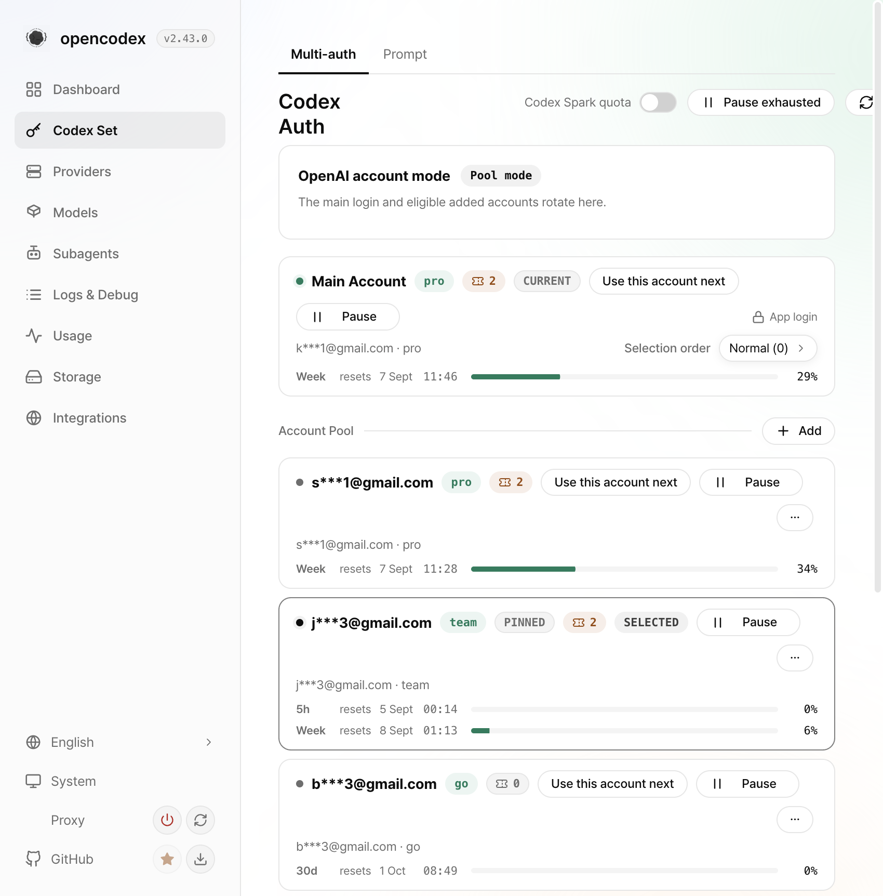
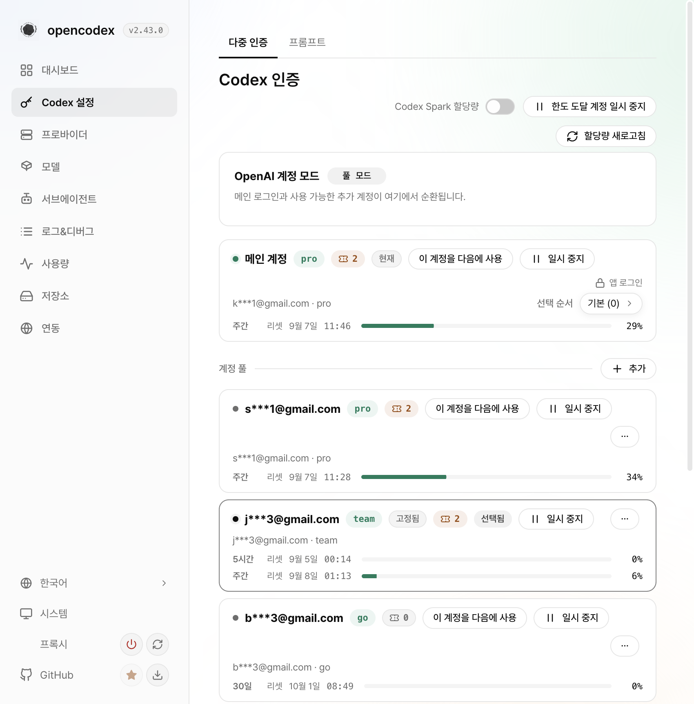
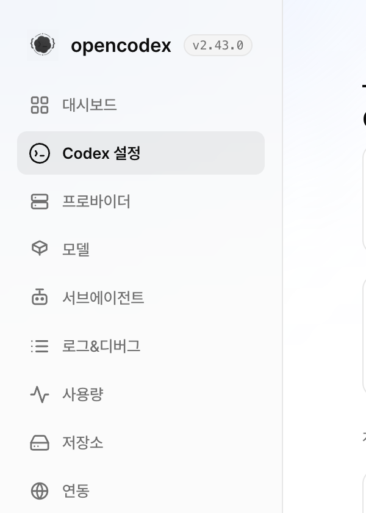
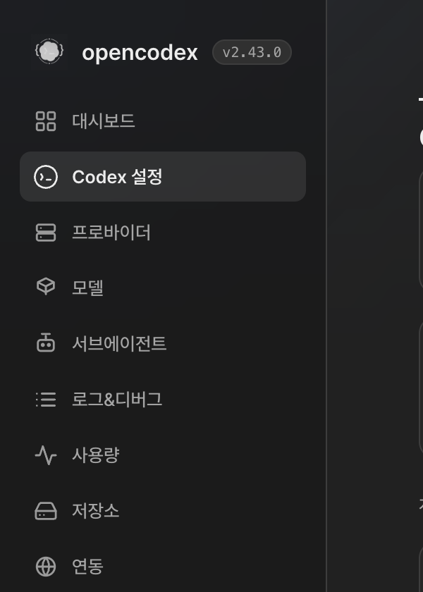

# 030 — Live verification record

Verified against the worktree GUI running on Vite at `:5199` with
`OPENCODEX_PROXY_TARGET=http://127.0.0.1:10100`, so the panel renders this
branch's code against the live proxy's real account data (v2.43.0, pid 32347).

## wp1 — page-head clipping

Measured rects, `.main-inner` right edge vs the rightmost button edge:

| viewport | container right | worst button right | overflow |
|---|---|---|---|
| 850px before | 840 | 944 | **yes — clipped** |
| 850px after | 840 | 804 | no |
| 700px after | 690 | 610 | no |

At 1440px the title and the action cluster still share one row 26px tall
(`titleTop == actionsTop`), so the wide layout did not change.

Before — "할당량 새로고침" sliced by the viewport edge:

After — the cluster wraps to a second right-aligned line:

## wp2 — the Codex mark

Live DOM of the nav row: `viewBox="0 0 32 32"`, `stroke="currentColor"`, one
path, rendered at 17x17 — the icon set's CSS sizing applies unchanged to the
32-unit box.

## Mechanical gates

`bun run typecheck`, `bun run lint:gui`, `bun run build:gui`, and the focused
`gui/tests/sidebar-codex-set.test.ts` (2 pass). The repository-wide suite was not
run — operator constraint for this unit.

## Delivery record

Two pull requests, both against `dev`, both merged with admin:

| PR | Content | Merge commit |
|---|---|---|
| #3465 | The two chrome fixes | `24c0409ae` |
| #3468 | Regression guards for both (`040`) | `903dfd6bc` |

Ancestry proven for each with `git fetch origin dev` followed by
`git merge-base --is-ancestor <merge-sha> FETCH_HEAD`; `origin/dev` moved
`2421e44ce → 24c0409ae → 903dfd6bc`.

#3468 needed the maintainer `gui-screenshot-waived` label. Its `enforce-target`
run failed on "missing UI screenshot" because the gate matches the word `gui` in
a title or path, and this PR is two test files and a devlog note with no runtime
change — there is no UI delta to capture. That is the false positive the waiver
label exists for, and the reason is recorded on the PR itself rather than only
here.
