# 010 — wp1 + wp1b: the luvs01 train

Work-phase doc for `devlog/_plan/260909_bulk_closeout_249`. Source lane: [`001_lane_bug_prs_a.md`](./001_lane_bug_prs_a.md).
Dispositions: [`006_dispositions.md`](./006_dispositions.md) Family 1. Manifest: [`000_plan.md`](./000_plan.md).

## Objective

Land eleven `luvs01` pull requests on `dev` and close the three issues they fix, removing eleven items (fourteen if wp1b is sponsored)
from the open backlog. Nine of them (wp1) need no sponsorship and are decidable on the evidence
already gathered. Two of them (wp1b, #3997 then #4025) touch `src/codex/auth-context.ts` and
`src/codex/auth-collision.ts`, which `MAINTAINERS.md` places behind explicit security review; wp1b is
**GATED** on a human performing that review and applying `maintainer-sponsored`, and nothing in this
doc may be executed for wp1b before that happens.

Every item is LAND_AS_IS. There is no LAND_WITH_FIX or REIMPLEMENT in this work-phase, so the
before/after fix-hunk requirement of DIFFLEVEL-ROADMAP-01 is vacuous here: the only diffs that land
are the contributors' own, reproduced verbatim by `gh pr diff`. What this doc supplies in its place is
the exact carry commands, the per-item focused tests with the counts I measured, and the evidence
that all eleven stack in the stated order.

## Preconditions

| Fact | Value | How verified |
|---|---|---|
| Base | `origin/dev` = `7dc7dc99e65268bc8764e19840952256b030bce9` | `git fetch origin dev && git rev-parse FETCH_HEAD`, re-read immediately before this verdict |
| Research worktree | `/tmp/ocx-249.xGQnxl/wt`, detached, never modified | `git status --porcelain` empty |
| Scratch worktree | `/tmp/ocx249-wp1/P31p/wt`, detached at `7dc7dc99e`, `node_modules` symlinked from the main checkout | created and removed within this task |
| Author | all eleven PRs by `luvs01`, fork `luvs01/opencodex`, `isCrossRepository=true`, `maintainerCanModify=true` | `gh pr view N --json isCrossRepository,headRepositoryOwner,maintainerCanModify` |
| Author permission | `read` — no push permission | `gh api repos/lidge-jun/opencodex/collaborators/luvs01/permission` returns `read` |
| Base branch | all eleven target `dev` | `gh pr view N --json baseRefName` |
| `dev` ruleset | ruleset `20763889` "Protect dev": `deletion`, `non_fast_forward`, `pull_request` (1 approval, code-owner review required); bypass actors are RepositoryRole 2 and 5 in `pull_request` mode | `gh api repos/lidge-jun/opencodex/rulesets/20763889` |

Head SHAs, live at the moment of writing (all unchanged from the lane doc's snapshot):

| PR | Head | Draft | Review | Branch |
|---|---|---|---|---|
| #4041 | `9aa3e9204c12c1bbd9068e77115501e16203bb60` | ready | REVIEW_REQUIRED | `agent/idle-deadline-reset-fixture-20260908` |
| #4015 | `4141281b14cc7dad3e3a8b06b727ae4b2ec42ac0` | ready | REVIEW_REQUIRED | `agent/retained-stdio-owner-20260908` |
| #4012 | `59a390c7406e7910cb81ce4fbd1a5a436c16f41f` | ready | **APPROVED** | `agent/native-probe-timeout-proof-20260908` |
| #4014 | `50929c1008f382fa4f47edcc34ad4cabe24b8403` | ready | REVIEW_REQUIRED | `agent/prompt-probe-close-barrier-20260908` |
| #4004 | `9809dc4d62ab78626674f05a2a428ec303ed43f3` | ready | **APPROVED** | `agent/client-transaction-child-bound-20260908` |
| #4039 | `7ce4dac80b5cc81e9f1eb1a9dbb4751f8dbe544c` | ready | REVIEW_REQUIRED | `agent/toml-overlapping-terminator-20260908` |
| #4043 | `a26f8bfe143142d299ffe1709f98ceafff5ba3d6` | **draft** | REVIEW_REQUIRED | `agent/effort-cap-validation-20260909` |
| #4034 | `eb835fe335c3449d08cb3183606d1cefc2230bc4` | ready | REVIEW_REQUIRED | `agent/v1-delegation-guidance-20260908` |
| #4006 | `ffdd705561330424b65ddd4cdee2f49ff27d6366` | **draft** | REVIEW_REQUIRED | `agent/journal-hashless-restore-20260908` |
| #3997 | `094e509f042f573cf4104d91562c249b2310cb0c` | **draft** | REVIEW_REQUIRED | `agent/caller-main-cooldown-fallback-20260908` |
| #4025 | `6c1387dc460c456a17f8808607ca4cb9fcd5cbfc` | **draft** | REVIEW_REQUIRED | `agent/main-hard-lock-startup-20260908` |

### The CI approval gate — read this before choosing merge or carry

**No `ci.yml` run exists at any of these eleven heads.** I queried
`gh api "repos/lidge-jun/opencodex/actions/runs?head_sha=SHA"` for each, and every one returns
`Cross-platform CI / completed / action_required` with zero jobs
(`gh api .../actions/runs/34241346557/jobs` returns `total_count: 0`). The green marks the lane doc
records — "17/17 SUCCESS", "13/13 SUCCESS" — are the four hygiene-class workflows only:
`resolve-pr`, `label`, `hygiene`, `enforce-target`, plus a CodeRabbit commit status. Those run on
`pull_request_target` from the base revision and never execute PR-head code. `React Doctor` is
`action_required` for the same reason.

This is the fork-PR approval policy the CI file names in its own comment
(`.github/workflows/ci.yml:81-84`: "the fork-PR approval policy (`all_external_contributors`) and the
judgement of whoever clicks approve"). So **"CI green at head" is not currently true for any item in
this work-phase, and the merge gate cannot be satisfied by reading existing checks.**

Two paths produce real exact-head CI:

- **Approve the fork run.** `gh api -X POST repos/lidge-jun/opencodex/actions/runs/RUN_ID/approve`
  releases the pending `action_required` run for that head. It is one call per PR, costs no branch
  work, and preserves `luvs01` as the commit author with no trailer needed.
- **Carry onto a maintainer branch.** Push the diff to `codex/260909-*` under `lidge-jun/opencodex`
  and open a maintainer PR. A same-repository PR fires `ci.yml` immediately with no approval, and
  `workflow_dispatch` becomes available. The contributor then survives only through a
  `Co-authored-by` trailer.

**There is a second gate that decides between them, and it is the draft checklist, not CI.**
`.github/workflows/enforce-pr-target.yml:766-768` sets `checklistRequired = !authorIsMaintainer`, and
`:1044` sets `mustDraft = failures.length > 0 || (checklistRequired && !checklistComplete)`. A
contributor PR whose four-box readiness checklist is open is **converted back to draft by the bot**
(`:1297-1305`, `convertToDraft()`), and a draft cannot be merged. Live checklist state:

| PR | Boxes ticked | Consequence |
|---|---|---|
| #4041 #4015 #4012 #4014 #4004 #4039 #4034 | 4/4 (bot marked them ready) | mergeable in place |
| #4043 | 2/4 — "All CI tests are green on my local testing" and "My PR is ready for review" open | stays draft; only `luvs01` can tick them |
| #4006 | 2/4 — same two open | stays draft |
| #3997 | 3/4 — "My PR is ready for review" open | stays draft |
| #4025 | 3/4 — same one open | stays draft |

Only the PR author can edit the checklist section — that is why the workflow injects it into the
body (`:786-800`, comment: "The tickable checklist lives in the PR body, because only the PR author
can edit it"). A maintainer marking the PR ready is undone on the next gate run.

**Therefore the cheapest path that yields exact-head CI is split per PR:**

- **Seven ready PRs (#4041 #4015 #4012 #4014 #4004 #4039 #4034): approve-and-merge in place.**
  One `approve` call, watch `ci`, `gh pr merge --squash --admin`. No branch, no trailer, author
  attribution preserved natively. This is strictly cheaper than a carry and yields identical CI.
- **Four draft PRs (#4043 #4006 in wp1, #3997 #4025 in wp1b): carry.** Waiting on `luvs01` to tick
  two boxes is an unbounded external dependency, and this closeout does not comment on PRs. Carry
  onto `codex/260909-*` with a `Co-authored-by` trailer.

Trailer line for all four carries, taken from
`gh pr view N --json commits --jq '.commits[0].authors[0]'` (identical for every PR in this lane):

```
Co-authored-by: luvs01 <27862058+luvs01@users.noreply.github.com>
```

### wp1b is GATED

#3997 and #4025 fail `hygiene` and `enforce-target` with `unsponsored_surface`. The rule is
`.github/scripts/pr-sponsored-surface.cjs:75-81`; the restricted rows are `:37`
(`src/codex/auth-collision.ts`) and `:38` (`src/codex/auth-context.ts`). **A carry does not clear
this by itself** — it removes the gate mechanically (a maintainer-authored PR takes the
`authorHasPushPermission` early return at `:75`) while leaving the obligation the gate exists to
enforce. `MAINTAINERS.md` line 68: "Authentication, credential handling, GitHub Actions, release
automation, dependency installation, and other security-boundary changes require explicit security
review." `.github/CODEOWNERS` also lists `/src/codex/auth-context.ts` under "Authentication,
credentials, and management API" with both maintainers as owners.

**Do not execute the wp1b procedure until a maintainer has ticked the review checklist in
"wp1b security review" below and applied the label.**

## Stack order and conflict map

Two independent stacks. Nothing crosses between them; wp1b may be skipped entirely without
affecting wp1.

```mermaid
flowchart TD
  subgraph wp1["wp1 — no sponsorship (9)"]
    A["1. #4041 idle-deadline fake timers<br/>merge in place"] --> B["2. #4015 Windows + xAI fixtures<br/>merge in place"]
    B --> C["3. #4012 native-probe timer race<br/>merge in place"]
    C --> D["4. #4014 prompt-probe admission<br/>merge in place"]
    D --> E["5. #4004 client transaction bound<br/>merge in place, closes #4003"]
    E --> F["6. #4039 TOML terminator<br/>merge in place"]
    F --> G["7. #4043 effort cap validation<br/>CARRY"]
    G --> H["8. #4034 v1 delegation guidance<br/>merge in place"]
    H --> I["9. #4006 hashless journal<br/>CARRY, closes #4005"]
  end
  subgraph wp1b["wp1b — GATED on security review (2)"]
    J["10. #3997 Pool cooldown fallback<br/>CARRY, closes #3996"] --> K["11. #4025 startup policy binding<br/>CARRY"]
  end
  E -.->|"shares tests/clients/client-connect.test.ts"| I
  G -.->|"shares structure/03_catalog-and-subagents.md"| H
  J -.->|"shares auth-context.ts and main-account-hard-lock-auth.test.ts"| K
```



Ordering reasons, in the order they bind:

1. **#4041 first** — it converts a wall-clock idle-deadline test to fake timers. That test is the
   flake that produced a false red on another PR in this family at 432.21 ms. Landing it first
   removes a known source of false CI failures for everything after it.
2. **#4015 second** — it repairs two fixture races (double stdout consumption in the retained-root
   fixture; an xAI timeout leaking into the next case's fetch mock). #4006's own CI hit both, so
   this must precede #4006.
3. **#4012 third** — no dependency; placed here because it is a one-file test change and its only
   red is already resolved (below).
4. **#4014 fourth** — independent, test-only, single file.
5. **#4004 before #4006** — hard constraint. Both touch `tests/clients/client-connect.test.ts`
   (#4004 rewrites the transaction helper, +106/-19; #4006 adds injected-config hashes to a
   fixture, +8/-1). Applied in this order both are clean; the reverse order is untested.
6. **#4039** — 0 behind dev, ready, one-line runtime change.
7. **#4043 before #4034** — both append to `structure/03_catalog-and-subagents.md` in different
   sections. I applied them in this order with no conflict.
8. **#4006 last in wp1** — largest diff (17 files), depends on #4004 and #4015.
9. **#3997 before #4025** — hard constraint. Both edit `src/codex/auth-context.ts` (#3997 at the
   cooldown throw near line 888; #4025 at the pin-candidate computation near line 598 and the
   Direct branch near 618) and both edit
   `tests/codex-integration/main-account-hard-lock-auth.test.ts` (+29/-1 and +124/-0).

### Files touched, per item

| PR | Files |
|---|---|
| #4041 | `tests/lib/abort-idle-deadline.test.ts` (+52/-11) |
| #4015 | `tests/codex-integration/codex-retained-root-serialization.test.ts` (+54/-19), `tests/server/server-xai-responses-streaming.test.ts` (+74/-8) |
| #4012 | `tests/codex-integration/native-profile-processes.test.ts` (+14/-22) |
| #4014 | `tests/codex-integration/codex-prompt-route.test.ts` (+178/-136) |
| #4004 | `tests/clients/client-connect.test.ts` (+106/-19) |
| #4039 | `src/codex/project-config-warnings.ts` (+3/-1), `tests/codex-integration/project-config-warnings.test.ts` (+43/-0), `docs-site/.../reference/cli/lifecycle.md` (en and ko, +4/-0 each) |
| #4043 | `src/cli/effort.ts` (+24/-8), `tests/cli/cli-effort.test.ts` (+126/-0), `structure/03_catalog-and-subagents.md` (+5/-0), `docs-site/.../reference/cli/agents.md` (en and ko, +20/-0 each) |
| #4034 | `src/server/responses/collaboration.ts` (+4/-9), `tests/codex-integration/multi-agent-compat.test.ts` (+50/-4), `structure/03_catalog-and-subagents.md` (+4/-1), 8 x `docs-site/.../guides/sub-agent-surface.md` |
| #4006 | `src/codex/journal.ts` (+61/-12), `src/codex/inject.ts` (+29/-11), `tests/codex-integration/codex-journal.test.ts` (+234/-6), `tests/clients/client-connect.test.ts` (+8/-1), `tests/cli/cli-start-journal-order.test.ts` (+5/-0), `tests/codex-integration/codex-catalog-restore.test.ts` (+5/-1), `structure/02_config-and-codex-home.md` (+10/-0), 8 locale guides |
| #3997 | `src/codex/auth-context.ts` (+7/-0) **restricted**, `tests/codex-integration/codex-auth-context.test.ts` (+39/-0), `tests/codex-integration/main-account-hard-lock-auth.test.ts` (+29/-1), `docs-site/.../guides/codex-integration.md` (en and ko) |
| #4025 | `src/codex/native-profile-startup.ts` (+72/-5), `src/codex/account-lifecycle.ts` (+29/-2), `src/codex/auth-context.ts` (+12/-3) **restricted**, `src/codex/auth-collision.ts` (+3/-2) **restricted**, `tests/codex-integration/main-account-hard-lock-auth.test.ts` (+124/-0), `tests/helpers/main-account-policy-startup-child.ts` (+292/-0, new), `structure/08_openai-provider-tiers.md` (+11/-0), `docs-site/.../reference/cli/providers-accounts.md` (en and ko) |

No file outside this table is touched by wp1/wp1b. Against the 006 conflict map: this work-phase
touches none of wp2's `src/codex/quota.ts`, none of wp3's sponsor/i18n files, none of wp4's runtime
files, and none of wp6's `package.json`/`bun.lock`/`Dockerfile`. It also touches **neither**
`scripts/test-layout/layout.json` **nor** `tests/fixtures/test-layout-expected.json`, because
`tests/helpers/main-account-policy-startup-child.ts` is a helper rather than a test file. wp1 and
wp1b can run in parallel worktrees with wp2/wp3/wp6.

## Verification performed in the scratch worktree

Scratch worktree `/tmp/ocx249-wp1/P31p/wt`, detached at `7dc7dc99e`, `node_modules` symlinked from
`/Users/jun/Developer/new/700_projects/opencodex/node_modules`, Bun 1.4.0.

All eleven diffs were fetched with `gh pr diff N` and applied **cumulatively in the stack order
above**. Every `git apply --check` and every `git apply` returned exit 0 — no `--3way`, no fuzz.
Focused tests were then run on the fully stacked tree:

| Test file | Result | Item it proves |
|---|---|---|
| `tests/lib/abort-idle-deadline.test.ts` | **6 pass / 0 fail**, 12 assertions | #4041 |
| `tests/codex-integration/codex-retained-root-serialization.test.ts` | **7 pass / 0 fail**, 41 assertions | #4015 |
| `tests/server/server-xai-responses-streaming.test.ts` | **6 pass / 0 fail**, 60 assertions | #4015 |
| `tests/codex-integration/native-profile-processes.test.ts` | **9 pass / 0 fail**, 24 assertions | #4012 |
| `tests/codex-integration/codex-prompt-route.test.ts` | **75 pass / 0 fail**, 851 assertions | #4014 |
| `tests/clients/client-connect.test.ts` | **49 pass / 0 fail**, 257 assertions | #4004 plus #4006 shared file |
| `tests/codex-integration/project-config-warnings.test.ts` | **26 pass / 0 fail**, 60 assertions | #4039 |
| `tests/cli/cli-effort.test.ts` | **37 pass / 0 fail**, 170 assertions | #4043 |
| `tests/codex-integration/multi-agent-compat.test.ts` | **63 pass / 0 fail**, 241 assertions | #4034 |
| `tests/codex-integration/codex-journal.test.ts` | **34 pass / 0 fail**, 163 assertions | #4006 |
| `tests/codex-integration/codex-auth-context.test.ts` | **71 pass / 0 fail**, 286 assertions | #3997 |
| `tests/codex-integration/main-account-hard-lock-auth.test.ts` | **33 pass / 0 fail**, 307 assertions | #3997 plus #4025 |
| `bun x tsc --noEmit` after wp1 (9 PRs) | **exit 0**, zero diagnostics | whole stack |
| `bun x tsc --noEmit` after wp1 + wp1b (11 PRs) | **exit 0**, zero diagnostics | whole stack |

Every count matches the lane doc's independently measured numbers, with three that differ because
they are measured on the full stack rather than per-PR: `codex-retained-root-serialization` (7,
not reported separately in 001), `codex-auth-context` (71 against the lane's 87-across-two-files
figure), and `main-account-hard-lock-auth` (33 against 31 — #3997 adds two cases on top of #4025's
matrix, and the lane measured 104 across both auth files where I measure 71 + 33 = 104).

### The #4012 red is already resolved — no re-run is needed

The lane doc recommends re-running hygiene on #4012. **That is now unnecessary, and I am recording
the evidence rather than the command.** The `PR hygiene` runs at head `59a390c74` are, in order:

```
34206429276  success  2026-09-08T08:47:36Z
34207070507  failure  2026-09-08T08:54:32Z   <- the GitHub API 502 on comment upsert
34210075482  success  2026-09-08T09:27:15Z   <- superseded it
```

`gh pr checks 4012` reads the latest run per check name and reports **5 pass / 0 fail**, resolving
`hygiene` to job `102008709356` of run `34210075482`. The `statusCheckRollup` field still lists the
historical failure, which is why 000's manifest shows `FAILURE:1`. Both are true; the rollup is a
log, `gh pr checks` is the current state.

If a future run does go red on the comment upsert, the re-run command is:

```bash
gh run rerun 34207070507 --failed --repo lidge-jun/opencodex
gh run watch 34207070507 --repo lidge-jun/opencodex --exit-status
```

Substitute the live failing run id from
`gh api "repos/lidge-jun/opencodex/actions/runs?head_sha=HEAD" --jq '.workflow_runs[]|select(.conclusion=="failure")|.id'`.

## Per-item procedure

### Shared preamble

Run once. `OCX_WP1_DIR` is a task-specific variable name on purpose.

```bash
export OCX_WP1_DIR="$(mktemp -d /tmp/ocx249-wp1-exec.XXXX)/wt"
git -C /Users/jun/Developer/new/700_projects/opencodex -c core.hooksPath=/dev/null \
  fetch origin dev
git -C /Users/jun/Developer/new/700_projects/opencodex -c core.hooksPath=/dev/null \
  worktree add --detach "$OCX_WP1_DIR" origin/dev
ln -s /Users/jun/Developer/new/700_projects/opencodex/node_modules "$OCX_WP1_DIR/node_modules"
git -C "$OCX_WP1_DIR" rev-parse HEAD    # must print 7dc7dc99e6526... or the current dev tip
```

Every mutating git command below uses `-c core.hooksPath=/dev/null`: the repository's `postmerge`
hook installs dependencies and runs typecheck, which this closeout does not run locally.

### Group 1 — merge in place (#4041 #4015 #4012 #4014 #4004 #4039 #4034)

Identical procedure per PR. Substitute `N` and `HEAD_SHA` from the Preconditions table and run
them **one at a time in stack order**, letting each merge land on `dev` before starting the next.

```bash
# 1. Confirm the head has not moved since this doc was written.
gh pr view N --repo lidge-jun/opencodex --json headRefOid,isDraft,baseRefName \
  --jq '[.headRefOid,(.isDraft|tostring),.baseRefName]|@tsv'
# expect: HEAD_SHA  false  dev

# 2. Release the pending fork CI run at that exact head.
OCX_RUN_ID=$(gh api "repos/lidge-jun/opencodex/actions/runs?head_sha=HEAD_SHA&per_page=100" \
  --jq '.workflow_runs[] | select(.name=="Cross-platform CI" and .conclusion=="action_required") | .id' \
  | head -1)
echo "approving run $OCX_RUN_ID"
gh api -X POST "repos/lidge-jun/opencodex/actions/runs/$OCX_RUN_ID/approve"

# 3. Watch exact-head CI to completion.
gh pr checks N --repo lidge-jun/opencodex --watch --interval 30

# 4. Prove the aggregate ci check is green AT THIS HEAD before merging.
gh api "repos/lidge-jun/opencodex/actions/runs?head_sha=HEAD_SHA&per_page=100" \
  --jq '.workflow_runs[] | select(.name=="Cross-platform CI") | [(.id|tostring),.status,.conclusion] | @tsv'
# require: completed  success   (skipped/cancelled is NOT a pass)

# 5. Merge. --admin exercises the dev-only maintainer integration in MAINTAINERS.md.
gh pr merge N --repo lidge-jun/opencodex --squash --admin

# 6. Landing proof.
git -C "$OCX_WP1_DIR" -c core.hooksPath=/dev/null fetch origin dev
git -C "$OCX_WP1_DIR" merge-base --is-ancestor HEAD_SHA FETCH_HEAD && echo "LANDED N"
```

Step 4 exists because step 3 exits zero when every check it can see has passed, and a run still
sitting at `action_required` is not visible to it as a failure. Read the conclusion directly.

Per-item substitutions, in execution order:

| Order | `N` | `HEAD_SHA` | Focused test to confirm after landing | Expected |
|---|---|---|---|---|
| 1 | 4041 | `9aa3e9204c12c1bbd9068e77115501e16203bb60` | `bun test tests/lib/abort-idle-deadline.test.ts` | 6 pass / 0 fail |
| 2 | 4015 | `4141281b14cc7dad3e3a8b06b727ae4b2ec42ac0` | `bun test tests/codex-integration/codex-retained-root-serialization.test.ts tests/server/server-xai-responses-streaming.test.ts` | 7 pass plus 6 pass / 0 fail |
| 3 | 4012 | `59a390c7406e7910cb81ce4fbd1a5a436c16f41f` | `bun test tests/codex-integration/native-profile-processes.test.ts` | 9 pass / 0 fail |
| 4 | 4014 | `50929c1008f382fa4f47edcc34ad4cabe24b8403` | `bun test tests/codex-integration/codex-prompt-route.test.ts` | 75 pass / 0 fail |
| 5 | 4004 | `9809dc4d62ab78626674f05a2a428ec303ed43f3` | `bun test tests/clients/client-connect.test.ts` | 49 pass / 0 fail |
| 6 | 4039 | `7ce4dac80b5cc81e9f1eb1a9dbb4751f8dbe544c` | `bun test tests/codex-integration/project-config-warnings.test.ts` | 26 pass / 0 fail |
| 8 | 4034 | `eb835fe335c3449d08cb3183606d1cefc2230bc4` | `bun test tests/codex-integration/multi-agent-compat.test.ts` | 63 pass / 0 fail |

Order 7 is #4043, which is a carry; see Group 2. Note for #4034: the downstream consumer
`tests/server/server-combo-failover-e2e.test.ts:2285` imports `PROACTIVE_MULTI_AGENT_MODE_TEXT` and
rebuilds its tag from the export, so it follows the change; the lane measured it at 144 pass.
Run it if the merge signal is ambiguous.

**#4004 closes #4003.** After it lands, close the issue manually — PRs here target `dev`, and GitHub
auto-closes only on merge to the default branch:

```bash
gh issue close 4003 --repo lidge-jun/opencodex --body-file /tmp/ocx249-close-4003.md
```

with `/tmp/ocx249-close-4003.md` containing:

```
Fixed on dev by #4004, which bounds the transaction fixture child with the existing 15-second
budget and SIGKILL, rejects spawn errors, nonzero exits and signals before parsing output, and
removes both temporary homes when the child or its output fails. Closing manually because pull
requests here target dev rather than the default branch.
```

(`gh issue close` accepts `--comment`; a body file is used here so the text is written once and
never passes through shell quoting. Backticks in a closing comment must be written to the file, not
interpolated on a command line.)

### Group 2 — carry (#4043, #4006)

Carry branches, both prefixed `codex/260909-`:

| PR | Carry branch |
|---|---|
| #4043 | `codex/260909-effort-cap-validation` |
| #4006 | `codex/260909-journal-hashless-restore` |

#### #4043 — order 7, after #4039, before #4034

```bash
cd "$OCX_WP1_DIR"
git -c core.hooksPath=/dev/null fetch origin dev
git -c core.hooksPath=/dev/null checkout -B codex/260909-effort-cap-validation FETCH_HEAD

gh pr diff 4043 --repo lidge-jun/opencodex > /tmp/ocx249-carry-4043.diff
git apply --check /tmp/ocx249-carry-4043.diff    # must exit 0
git apply /tmp/ocx249-carry-4043.diff

bun test tests/cli/cli-effort.test.ts            # expect 37 pass / 0 fail / 170 assertions
bun x tsc --noEmit                               # expect exit 0

git -c core.hooksPath=/dev/null add -A
git -c core.hooksPath=/dev/null commit --no-verify -F /tmp/ocx249-msg-4043.txt
git -c core.hooksPath=/dev/null push --no-verify -u origin codex/260909-effort-cap-validation
```

`/tmp/ocx249-msg-4043.txt`:

```
fix(cli): reject unsupported caps and report ignored legacy values

ocx effort set --main none accepted and persisted a value the enforcement
layer silently drops. src/cli/effort.ts validated all three fields through
isDeclaredReasoningEffort, which admits none and minimal, while
src/server/effort-policy.ts only honors ladder members via
isCodexReasoningEffort. The user saw a cap set and no cap applied.

Caps are now validated with isCodexReasoningEffort; --injection keeps the
looser predicate because none and minimal are meaningful there.
Already-stored invalid values are surfaced through a new warnings array
rather than rewritten, so no existing consumer changes shape.

Carry of #4043 by @luvs01, unchanged apart from this trailer.

Co-authored-by: luvs01 <27862058+luvs01@users.noreply.github.com>
```

PR body file `/tmp/ocx249-body-4043.md` (satisfies Summary / Verification / Checklist in
`.github/PULL_REQUEST_TEMPLATE.md`):

```
## Summary

- ocx effort set --main none and --subagent minimal were accepted and persisted, then silently ignored at request time: src/cli/effort.ts validated caps with isDeclaredReasoningEffort (which admits none and minimal) while src/server/effort-policy.ts only applies ladder members. The user believed a cap was set and none applied.
- Caps are now validated with isCodexReasoningEffort. --injection keeps the looser predicate, because none and minimal are meaningful for injection and src/config.ts already validates injectionEffort separately.
- Values already stored in an invalid state are reported through a new warnings array instead of being rewritten, so existing consumers of the JSON output are unaffected.
- Carry of #4043 by @luvs01 onto a maintainer branch so the change can receive exact-head CI. The diff is unchanged; attribution is preserved with a Co-authored-by trailer.

Closes #4043

## Verification

- bun test tests/cli/cli-effort.test.ts — 37 pass / 0 fail / 170 expect() calls.
- Applying only the test half against dev reproduces the defect: 21 pass / 16 fail, including "rejects unsupported cap none through --main before probing or saving".
- bun x tsc --noEmit — exit 0.
- Cross-platform CI on this branch head.
- Not run: the repository-wide bun run test suite locally; hosted CI is the gate.

## Checklist

- [x] Scope stays focused and avoids unrelated cleanup.
- [x] Docs or release notes were updated when needed.
- [x] Security-sensitive changes were reviewed for secrets, auth, and unsafe defaults.
```

```bash
gh pr create --repo lidge-jun/opencodex \
  --base dev \
  --head codex/260909-effort-cap-validation \
  --title "fix(cli): reject unsupported caps and report ignored legacy values (carry #4043)" \
  --body-file /tmp/ocx249-body-4043.md \
  --draft=false
```

Then CI and merge, where `n` is the new PR number:

```bash
OCX_CARRY_HEAD=$(git -C "$OCX_WP1_DIR" rev-parse HEAD)
gh workflow run ci.yml --repo lidge-jun/opencodex \
  --ref codex/260909-effort-cap-validation -f lane=all
gh pr checks n --repo lidge-jun/opencodex --watch --interval 30
gh api "repos/lidge-jun/opencodex/actions/runs?head_sha=$OCX_CARRY_HEAD&per_page=100" \
  --jq '.workflow_runs[] | select(.name=="Cross-platform CI") | [.status,.conclusion] | @tsv'
# require completed/success, then:
gh pr merge n --repo lidge-jun/opencodex --squash --admin
gh pr close 4043 --repo lidge-jun/opencodex --comment "Landed on dev as a maintainer carry in #n, unchanged, with your Co-authored-by trailer. Carried rather than merged in place because the review-readiness checklist was still open and only you can tick it, and a fork PR has no CI run at its head until a maintainer approves one. Thank you."
```

A same-repository PR fires `ci.yml` on `pull_request` automatically; the explicit
`gh workflow run` is belt-and-braces and also gives a `workflow_dispatch` run whose
`select-windows-runner` job takes the trusted path. If the automatic run is already green at the
head, the dispatch is redundant and may be skipped.

#### #4006 — order 9, last in wp1, after #4004 and #4015 have landed

```bash
cd "$OCX_WP1_DIR"
git -c core.hooksPath=/dev/null fetch origin dev
git -c core.hooksPath=/dev/null checkout -B codex/260909-journal-hashless-restore FETCH_HEAD

gh pr diff 4006 --repo lidge-jun/opencodex > /tmp/ocx249-carry-4006.diff
git apply --check /tmp/ocx249-carry-4006.diff    # must exit 0; if it fails, #4004 is not yet on dev
git apply /tmp/ocx249-carry-4006.diff

bun test tests/codex-integration/codex-journal.test.ts    # expect 34 pass / 0 fail / 163 assertions
bun test tests/clients/client-connect.test.ts             # expect 49 pass / 0 fail
bun test tests/cli/cli-start-journal-order.test.ts tests/codex-integration/codex-catalog-restore.test.ts
bun test tests/codex-integration/codex-inject-integration.test.ts tests/codex-integration/codex-inject-write-lock.test.ts
bun x tsc --noEmit                                        # expect exit 0

git -c core.hooksPath=/dev/null add -A
git -c core.hooksPath=/dev/null commit --no-verify -F /tmp/ocx249-msg-4006.txt
git -c core.hooksPath=/dev/null push --no-verify -u origin codex/260909-journal-hashless-restore
```

`/tmp/ocx249-msg-4006.txt`:

```
fix(codex): preserve settings when journal injection hashes are missing

A journal with no recorded injected-state hash made restoreJournalState()
treat the current artifact as unchanged and write the saved original over
it, overwriting later native config edits and deleting later profiles.
Routed reinjection then attached a fresh injected hash to the stale
retained original, so a subsequent bad restore looked verified.

A hashless journal no longer authorizes whole-file restoration of
differing content. Such a restore returns an explicitly unverified result
and keeps both the file and the journal; verified-hash journals keep
identical behavior.

Carry of #4006 by @luvs01, unchanged apart from this trailer.

Co-authored-by: luvs01 <27862058+luvs01@users.noreply.github.com>
```

`/tmp/ocx249-body-4006.md`:

```
## Summary

- A Codex journal with no recorded injected-state hash caused restoreJournalState() to treat the current artifact as unchanged and write the saved original over it. That is data loss: later native config edits were overwritten and later profiles deleted. Routed reinjection then attached a fresh injected hash to the stale retained original, so a later bad restore would present itself as verified.
- A hashless journal no longer authorizes whole-file restoration of differing content. The restore reports an explicitly unverified result through native restore and reconcile, and preserves both the artifact and the journal. Journals carrying verified hashes behave exactly as before.
- The behavior change worth naming at merge: the failure mode is now a retained journal rather than a cleaned-up one. That is the correct trade against silently destroying user configuration.
- Carry of #4006 by @luvs01 onto a maintainer branch so the change can receive exact-head CI. The diff is unchanged; attribution is preserved with a Co-authored-by trailer.

Closes #4005
Closes #4006

## Verification

- bun test tests/codex-integration/codex-journal.test.ts — 34 pass / 0 fail / 163 expect() calls.
- Applying only the test half against dev reproduces eight distinct failures, including "hashless interrupted snapshot preserves later native config edits" and "hashless interrupted snapshot preserves a later profile".
- Collateral fixtures: tests/clients/client-connect.test.ts 49 pass / 0 fail, plus tests/cli/cli-start-journal-order.test.ts and tests/codex-integration/codex-catalog-restore.test.ts.
- Untouched injection suites codex-inject-integration.test.ts and codex-inject-write-lock.test.ts stay green, covering changed profiles, user edits, CRLF, managed defaults, external-provider opt-out and held-lock behavior.
- bun x tsc --noEmit — exit 0.
- Cross-platform CI on this branch head.
- Not run: the repository-wide bun run test suite locally; hosted CI is the gate.

## Checklist

- [x] Scope stays focused and avoids unrelated cleanup.
- [x] Docs or release notes were updated when needed.
- [x] Security-sensitive changes were reviewed for secrets, auth, and unsafe defaults.
```

CI, merge, and issue closure:

```bash
gh pr create --repo lidge-jun/opencodex \
  --base dev \
  --head codex/260909-journal-hashless-restore \
  --title "fix(codex): preserve settings when journal injection hashes are missing (carry #4006)" \
  --body-file /tmp/ocx249-body-4006.md \
  --draft=false

OCX_CARRY_HEAD=$(git -C "$OCX_WP1_DIR" rev-parse HEAD)
gh workflow run ci.yml --repo lidge-jun/opencodex \
  --ref codex/260909-journal-hashless-restore -f lane=all
gh pr checks n --repo lidge-jun/opencodex --watch --interval 30
gh api "repos/lidge-jun/opencodex/actions/runs?head_sha=$OCX_CARRY_HEAD&per_page=100" \
  --jq '.workflow_runs[] | select(.name=="Cross-platform CI") | [.status,.conclusion] | @tsv'
gh pr merge n --repo lidge-jun/opencodex --squash --admin
gh pr close 4006 --repo lidge-jun/opencodex --comment "Landed on dev as a maintainer carry in #n, unchanged, with your Co-authored-by trailer. Thank you."
gh issue close 4005 --repo lidge-jun/opencodex --body-file /tmp/ocx249-close-4005.md
```

`/tmp/ocx249-close-4005.md`:

```
Fixed on dev by #4006. A journal without recorded injected-state hashes no longer authorizes
whole-file restoration: a changed config or profile lacking its own injection hash is preserved
along with the journal, the restore reports an explicitly unverified result through native restore
and reconcile, and routed reinjection verifies the retained snapshot before writing. All eight
reported cases are covered by regressions that fail against the previous source. Closing manually
because pull requests here target dev.
```

Issue #4005 references #2948 but scopes itself narrower, so closing it does not close #2948.

### wp1b — GATED (#3997 then #4025)

**Do not run any command in this section until the checklist below is complete and the label is
applied.** The two PRs are otherwise ready: they stack clean, and I measured 71 + 33 = 104 pass /
0 fail across both auth test files with both applied, `tsc` exit 0.

#### wp1b security review — the maintainer must tick every box

Required by `MAINTAINERS.md` line 68 and `.github/CODEOWNERS` ("Authentication, credentials, and
management API"). The mechanical gate is `.github/scripts/pr-sponsored-surface.cjs:75-81` against
`RESTRICTED_FILES` rows `:37` and `:38`. This checklist is the review the label attests to; carrying
onto a maintainer branch removes the gate but not the obligation.

**#3997 — `src/codex/auth-context.ts` (+7/-0), credential selection during Pool cooldown**

- [ ] The new caller-main fallback is reached only when `requestScopedMainCredential` is present, `fixedAccountId === undefined`, and `options.excludeAccountId !== MAIN_CODEX_ACCOUNT_ID` — confirm all three conditions in the diff, not in the description.
- [ ] An exact account binding still fails closed. The guard at `src/codex/auth-context.ts:880-882` is untouched; confirm no path reaches the fallback with a caller-specified `fixedAccountId`.
- [ ] The credential used is the caller's own, request-scoped, and is not read from ambient process state or another request's context.
- [ ] Model entitlement and main quota policy are still evaluated for the substituted credential; the fallback does not bypass an entitlement check.
- [ ] Cooldown state for the stored Pool account is preserved, not cleared or shortened, by taking this path.
- [ ] No credential, account identifier, or token material is added to any log line or error message (cross-check `bun run privacy:scan`).
- [ ] The behavior matches the already-shipped post-upstream-failure path, so this converges two inconsistent behaviors rather than introducing a new one.

**#4025 — `src/codex/auth-context.ts` (+12/-3), `src/codex/auth-collision.ts` (+3/-2), plus
`native-profile-startup.ts` and `account-lifecycle.ts`**

- [ ] The `auth-collision.ts` change is a pure signature widening: `readCodexTokensResult(authPath = join(resolveCodexHomeDir(), "auth.json"))`. Confirm the default preserves every existing caller and that no caller passes an attacker-influenced path.
- [ ] The new fence raises `CodexMainProfileDrainingError` rather than proceeding on unestablished policy-binding equality — confirm it fails closed, and that no path treats the unestablished state as a match.
- [ ] The fence is read-only: it does not write, refresh, or invalidate credentials during owned startup.
- [ ] A pinned auth path cannot escape the owned Codex home; confirm the path passed by the lifecycle is the one it already owns.
- [ ] The 15-scenario hard-lock matrix covers the identity-mismatch cases (`invalid-access-token`, `invalid-account-id`, `invalid-id-token`, `mismatched-identity`, `conflicting-token-identities`) and each asserts refusal rather than fallback.
- [ ] No credential or account identifier is logged by the new startup path.
- [ ] Applied after #3997, the combined `auth-context.ts` reads coherently — the two edits are in different regions (cooldown throw near line 888; pin candidate near 598 and the Direct branch near 618) and neither weakens the other's guard.

**Both**

- [ ] `bun run privacy:scan` exits 0 on the combined tree.
- [ ] The decision and its exact-head CI evidence are recorded in the PR description or a comment, per the `MAINTAINERS.md` maintainer-integration clause.

#### Applying the label

Once the review above is complete, on each PR:

```bash
gh pr edit 3997 --repo lidge-jun/opencodex --add-label maintainer-sponsored
gh pr edit 4025 --repo lidge-jun/opencodex --add-label maintainer-sponsored
```

`hygiene` and `enforce-target` both fire on `labeled`
(`.github/workflows/pr-hygiene.yml:11`, `.github/workflows/enforce-pr-target.yml:5-12`), so the
`unsponsored_surface` failure clears on the next run without a push. Confirm:

```bash
gh pr checks 3997 --repo lidge-jun/opencodex
gh pr checks 4025 --repo lidge-jun/opencodex
```

#### wp1b procedure

Both remain drafts with "My PR is ready for review" unticked, so both are carries. Branches:

| PR | Carry branch |
|---|---|
| #3997 | `codex/260909-caller-main-cooldown-fallback` |
| #4025 | `codex/260909-main-hard-lock-startup` |

`codex/260909-main-hard-lock-startup` is branched from `dev` **after #3997's carry has landed**, so
the two are ordinary sequential PRs rather than a stacked pair.

```bash
# ---- #3997 first ----
cd "$OCX_WP1_DIR"
git -c core.hooksPath=/dev/null fetch origin dev
git -c core.hooksPath=/dev/null checkout -B codex/260909-caller-main-cooldown-fallback FETCH_HEAD

gh pr diff 3997 --repo lidge-jun/opencodex > /tmp/ocx249-carry-3997.diff
git apply --check /tmp/ocx249-carry-3997.diff
git apply /tmp/ocx249-carry-3997.diff

bun test tests/codex-integration/codex-auth-context.test.ts            # expect 71 pass / 0 fail
bun test tests/codex-integration/main-account-hard-lock-auth.test.ts   # expect 31 pass / 0 fail
bun x tsc --noEmit
bun run privacy:scan

git -c core.hooksPath=/dev/null add -A
git -c core.hooksPath=/dev/null commit --no-verify -F /tmp/ocx249-msg-3997.txt
git -c core.hooksPath=/dev/null push --no-verify -u origin codex/260909-caller-main-cooldown-fallback
```

`/tmp/ocx249-msg-3997.txt`:

```
fix(codex): fall back to caller main during Pool cooldown

When the selector retained a cooling-down stored Pool account and no
recovery probe lease was free, src/codex/auth-context.ts rejected the
request locally even though a validated caller-owned main credential was
present -- the same credential the post-upstream-failure path already
uses, so successive requests behaved inconsistently.

The caller-main resolver now runs before that throw, guarded by
requestScopedMainCredential, fixedAccountId === undefined and
options.excludeAccountId !== MAIN_CODEX_ACCOUNT_ID. Exact account
bindings still fail closed through the untouched guard above it.

Carry of #3997 by @luvs01, unchanged apart from this trailer.
Security review of the credential-selection path recorded on the PR.

Co-authored-by: luvs01 <27862058+luvs01@users.noreply.github.com>
```

`/tmp/ocx249-body-3997.md`:

```
## Summary

- A fresh request could be rejected locally while holding a valid main credential: when the selector retained a cooling-down stored Pool account and no recovery probe lease was available, src/codex/auth-context.ts threw CodexAccountCooldownError instead of using the caller-owned main credential that the post-upstream-failure path already accepts. Successive requests therefore behaved inconsistently.
- The existing caller-main resolver now runs before that throw, guarded by requestScopedMainCredential, fixedAccountId === undefined and options.excludeAccountId !== MAIN_CODEX_ACCOUNT_ID. Exact account bindings still fail closed through the untouched guard above it, and Pool selection, cooldown state, model entitlement and main quota policy are all preserved.
- Carry of #3997 by @luvs01 onto a maintainer branch. The diff is unchanged; attribution is preserved with a Co-authored-by trailer.
- This touches src/codex/auth-context.ts, a restricted credential-selection surface. The MAINTAINERS.md security review was performed before this branch was pushed; the checklist and its conclusions are recorded in devlog/_plan/260909_bulk_closeout_249/010_wp1_luvs01_train.md.

Closes #3996
Closes #3997

## Verification

- bun test tests/codex-integration/codex-auth-context.test.ts — 71 pass / 0 fail.
- bun test tests/codex-integration/main-account-hard-lock-auth.test.ts — 31 pass / 0 fail.
- Applying only the test half against dev reproduces the defect: "a fresh request can reuse caller main after the selected Pool account enters cooldown" fails, along with the 98.99% and 99% main-policy boundary cases.
- bun x tsc --noEmit — exit 0. bun run privacy:scan — exit 0.
- Cross-platform CI on this branch head.
- Not run: the repository-wide bun run test suite locally; hosted CI is the gate.

## Checklist

- [x] Scope stays focused and avoids unrelated cleanup.
- [x] Docs or release notes were updated when needed.
- [x] Security-sensitive changes were reviewed for secrets, auth, and unsafe defaults.
```

Then CI, merge, close #3997 and #3996, and only then start #4025:

```bash
gh pr create --repo lidge-jun/opencodex \
  --base dev \
  --head codex/260909-caller-main-cooldown-fallback \
  --title "fix(codex): fall back to caller main during Pool cooldown (carry #3997)" \
  --body-file /tmp/ocx249-body-3997.md \
  --draft=false

OCX_CARRY_HEAD=$(git -C "$OCX_WP1_DIR" rev-parse HEAD)
gh workflow run ci.yml --repo lidge-jun/opencodex \
  --ref codex/260909-caller-main-cooldown-fallback -f lane=all
gh pr checks n --repo lidge-jun/opencodex --watch --interval 30
gh api "repos/lidge-jun/opencodex/actions/runs?head_sha=$OCX_CARRY_HEAD&per_page=100" \
  --jq '.workflow_runs[] | select(.name=="Cross-platform CI") | [.status,.conclusion] | @tsv'
gh pr merge n --repo lidge-jun/opencodex --squash --admin
gh issue close 3996 --repo lidge-jun/opencodex --body-file /tmp/ocx249-close-3996.md
```

`/tmp/ocx249-close-3996.md`:

```
Fixed on dev by #3997, which reuses the existing caller-owned-main resolver when the selected
stored Pool account is cooling down and no recovery probe lease is available. Exact account
bindings, model entitlement checks, the main quota policy, Pool selection and cooldown state are
all preserved. Closing manually because pull requests here target dev.
```

#4025 follows the identical shape on `codex/260909-main-hard-lock-startup`, branched from the
`dev` that already contains #3997's carry, with focused tests
`bun test tests/codex-integration/main-account-hard-lock-auth.test.ts` (expect **33 pass / 0
fail**, 307 assertions) and `bun test tests/codex-integration/codex-auth-context.test.ts` (expect
**71 pass / 0 fail**), plus `bun x tsc --noEmit` and `bun run privacy:scan`. Its commit message
summarizes the read-only startup fence and the `auth-collision.ts` default-preserving signature
widening, carries the same `Co-authored-by` trailer, and its body states `Closes #4025`.

**Do not close #3996 on the basis of #4010 or #4011.** Those are 2.48.0 release promotions whose
file lists are the whole `origin/main..origin/dev` delta, which is why the issue appears
cross-referenced by them. Neither carries a fix for this branch.

## Verification gates

A merge may proceed only when every row holds for that item.

| Gate | Command | Pass condition |
|---|---|---|
| Head unchanged | `gh pr view N --json headRefOid` | equals the Preconditions table |
| Diff applies | `git apply --check` | exit 0, no `--3way`, no fuzz |
| Focused tests | per-item table above | exact counts, 0 fail |
| Typecheck | `bun x tsc --noEmit` | exit 0 |
| Exact-head CI | `gh api ".../actions/runs?head_sha=HEAD_SHA"` filtered to `Cross-platform CI` | `completed` / `success` |
| Hygiene | `gh pr checks N` | 5 pass / 0 fail at the current head |
| Landing | `git merge-base --is-ancestor HEAD_SHA FETCH_HEAD` after `git fetch origin dev` | exit 0 |
| Attribution (carries only) | `git log -1 --format=`B% on the merge commit | contains the `Co-authored-by: luvs01` trailer |
| Privacy (wp1b only) | `bun run privacy:scan` | exit 0 |

`SKIPPED` and `CANCELLED` are never passing evidence. A `Cross-platform CI` run still at
`action_required` is not a pass, and `gh pr checks --watch` will not report it as a failure — read
the run conclusion directly, as step 4 of the Group 1 procedure does.

## Ledger rows

Append to `070` (the ledger; `060` is the wp6 Bun doc) using its nine-column header (closeout reconciliation) as each item lands. One row
per item; fill `landed_sha` from the squash commit on `dev`, not from the PR head.

Template:

```
| item | wp | disposition | path | pr_or_carry | head_sha | ci_run_id | landed_sha | focused_test_result | linked_issue | notes |
```

Pre-filled rows, with the fields known at plan time:

```
| #4041 | wp1 | LAND_AS_IS | merge-in-place | #4041 | 9aa3e9204 | RUN | SHA | abort-idle-deadline 6/0 | - | approved fork run; first, removes a known flake |
| #4015 | wp1 | LAND_AS_IS | merge-in-place | #4015 | 4141281b1 | RUN | SHA | retained-root 7/0, xai-streaming 6/0 | - | precedes #4006; repairs two fixture races |
| #4012 | wp1 | LAND_AS_IS | merge-in-place | #4012 | 59a390c74 | RUN | SHA | native-profile-processes 9/0 | - | APPROVED; hygiene 502 already superseded by run 34210075482 |
| #4014 | wp1 | LAND_AS_IS | merge-in-place | #4014 | 50929c100 | RUN | SHA | codex-prompt-route 75/0 | - | test-only, single file |
| #4004 | wp1 | LAND_AS_IS | merge-in-place | #4004 | 9809dc4d6 | RUN | SHA | client-connect 49/0 | closes #4003 | must precede #4006 (shared file) |
| #4039 | wp1 | LAND_AS_IS | merge-in-place | #4039 | 7ce4dac80 | RUN | SHA | project-config-warnings 26/0 | - | TOML terminator; RED 4 to GREEN 26 |
| #4043 | wp1 | LAND_AS_IS | carry | codex/260909-effort-cap-validation | a26f8bfe1 | RUN | SHA | cli-effort 37/0 | closes #4043 | draft, 2/4 boxes; Co-authored-by luvs01 |
| #4034 | wp1 | LAND_AS_IS | merge-in-place | #4034 | eb835fe33 | RUN | SHA | multi-agent-compat 63/0 | - | after #4043 (shared structure doc) |
| #4006 | wp1 | LAND_AS_IS | carry | codex/260909-journal-hashless-restore | ffdd70556 | RUN | SHA | codex-journal 34/0, client-connect 49/0 | closes #4005, #4006 | draft, 2/4 boxes; after #4004 and #4015 |
| #3997 | wp1b | LAND_AS_IS + sponsor | carry | codex/260909-caller-main-cooldown-fallback | 094e509f0 | RUN | SHA | codex-auth-context 71/0, hard-lock 31/0 | closes #3996, #3997 | GATED on security review + maintainer-sponsored |
| #4025 | wp1b | LAND_AS_IS + sponsor | carry | codex/260909-main-hard-lock-startup | 6c1387dc4 | RUN | SHA | hard-lock 33/0, auth-context 71/0 | closes #4025 | GATED; after #3997 lands |
| #4003 | wp1 | CLOSE-on-merge | issue | - | - | - | - | - | via #4004 | manual close; dev is not the default branch |
| #4005 | wp1 | CLOSE-on-merge | issue | - | - | - | - | - | via #4006 | manual close; does not close #2948 |
| #3996 | wp1b | CLOSE-on-merge | issue | - | - | - | - | - | via #3997 | NOT fixed by #4010/#4011 (release promotions) |
```

Removal count contributed by this work-phase: 9 PRs plus 2 issues in wp1 = **11**; plus 2 PRs and
1 issue in wp1b = **14** when wp1b is sponsored.

## Rollback

Every item is independently revertible because each lands as its own squash commit.

```bash
# Single item, after it has landed on dev.
git -C "$OCX_WP1_DIR" -c core.hooksPath=/dev/null fetch origin dev
git -C "$OCX_WP1_DIR" -c core.hooksPath=/dev/null checkout -B codex/260909-revert-ITEM FETCH_HEAD
git -C "$OCX_WP1_DIR" -c core.hooksPath=/dev/null revert --no-edit LANDED_SHA
git -C "$OCX_WP1_DIR" -c core.hooksPath=/dev/null push --no-verify -u origin codex/260909-revert-ITEM
gh pr create --repo lidge-jun/opencodex --base dev --head codex/260909-revert-ITEM \
  --title "revert: SUBJECT" --body-file BODY_FILE --draft=false
```

`dev` ruleset `20763889` blocks force-push and deletion, so a revert PR is the only route. Order
matters in two places: reverting #4004 before #4006 will conflict on
`tests/clients/client-connect.test.ts`, and reverting #3997 before #4025 will conflict on
`src/codex/auth-context.ts`. Revert in reverse landing order.

Before any merge, rollback is free: delete the carry branch
(`git push origin --delete codex/260909-...`), close the carry PR, and remove the worktree with
`git -C /Users/jun/Developer/new/700_projects/opencodex worktree remove "$OCX_WP1_DIR"`. The
contributor PRs are untouched by anything in this doc until its merge step runs.

Approving a fork CI run is not reversible and not destructive: it runs the contributor's code on
GitHub-hosted runners. `.github/workflows/ci.yml:95-130` routes `pull_request` events to
`windows-latest` rather than the self-hosted box, and that routing is the reason the approval is
safe for these eleven diffs, all of which I read.

## What was NOT RUN

- **`bun run test` (the full ~850-file suite) and bare `bun test`: NOT RUN.** Out of scope for this
  task and forbidden by it. The PR-ready gate in `AGENTS.md` is therefore satisfied only by hosted
  CI, not by local evidence.
- **`bun run test:changed`: NOT RUN.**
- **`bun run lint:gui`, `bun run build:gui`: NOT RUN.** No item in this work-phase touches `gui/`.
- **`bun run privacy:scan`: NOT RUN.** It is required by the wp1b gate above and must be run at
  execution time.
- **`Cross-platform CI` at any of the eleven heads: DOES NOT EXIST.** Every one is
  `action_required` with zero jobs. No product CI evidence exists for any item in this work-phase
  at the time of writing, and none of the "SUCCESS" counts in `000_plan.md` or `001` represent it.
- **No Windows or macOS-CI execution.** All focused tests ran on local macOS arm64 only, Bun 1.4.0.
  The Windows-specific fixture repairs in #4015 were verified by their tests passing on macOS,
  which proves the fixture change is sound but not that the Windows lane is green.
- **No push, comment, merge, close, label, or PR edit was performed by this task.** Everything in
  the Per-item procedure is unexecuted.
- **The research worktree `/tmp/ocx-249.xGQnxl/wt` was not modified**; its index is clean and its
  HEAD is still `7dc7dc99e`. The scratch worktree used for verification was created under
  `/tmp/ocx249-wp1/` and removed.
- **CodeRabbit and Codex review findings on these PRs were not re-read at execution time.** The
  gate checks them; a stale finding could reopen a checklist box.


