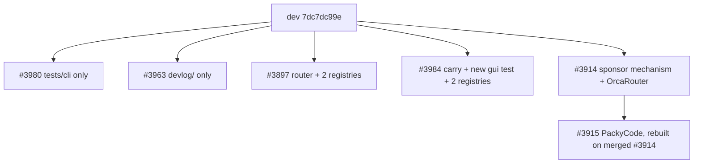

# 030 — wp3: small non-bug PRs and the sponsor pair

Diff-level roadmap for work-phase wp3 (DIFFLEVEL-ROADMAP-01). Sources: `003_lane_small_nonbug.md` (lane C),
`005_lane_feature_issues_and_stale_prs.md` (lane E), dispositions in `006_dispositions.md` Family 3.

Base: `origin/dev` = `7dc7dc99e65268bc8764e19840952256b030bce9`, re-fetched at write time and unchanged from
the lane snapshot. Research worktree `/tmp/ocx-249.xGQnxl/wt` (read-only, index never touched). All rehearsal
ran in a disposable scratch worktree created with `git worktree add --detach` and removed afterwards.

## Objective

Land six pull requests and close one issue, in two independent groups.

The first group is four small PRs that need no product judgment: a test-fixture determinism fix (#3980), a
router import-cycle extraction that resolves issue #3894 (#3897), a docs-only asset retirement (#3963), and a
GUI hook-dependency correction that ships blocked on `missing_regression_test` and is carried here with the
test it lacks (#3984).

The second group is the sponsor pair #3914 → #3915. Both are `CONFLICTING` only in the two test-layout
registry files and both carry the *same* sponsor mechanism, so they land strictly in order with the second
rebuilt on the first. Coverage contribution: 6 PRs merged plus issue #3894 closed manually = 7 backlog items.

Every landing in this doc is conditional on hosted CI passing at the exact head that gets merged. Local
focused tests below are macOS Bun 1.4.0 evidence and do not substitute for the Linux/Windows matrix.

## Preconditions

**Head SHAs, verified live at write time (all six unchanged since the lane snapshot):**

| PR | Author | Head SHA | Draft | Mergeable | Fork? | `maintainerCanModify` |
|----|--------|----------|-------|-----------|-------|---------------------|
| #3980 | yansigit | `b855765dd83f77162b13b00599f41b1447d9020d` | draft | MERGEABLE | yes (`yansigit/opencodex`) | true |
| #3897 | parkjs101 | `356f2c1db4e96a0a43e3d3209d35d97ec4e30291` | draft | MERGEABLE | yes (`parkjs101/opencodex`) | true |
| #3963 | luvs01 | `5497cd9943c4b4c26e7b99926d9f0725b16f1cce` | draft | MERGEABLE | yes (`luvs01/opencodex`) | true |
| #3984 | yansigit | `35a4d99d672545bf16d37c5d94a05cf6ff472982` | draft | MERGEABLE | yes (`yansigit/opencodex`) | true |
| #3914 | lidge-jun | `713ce6b028b07b9570c96d49f7e7d06144c255b5` | ready | CONFLICTING | **no — same repo** | false |
| #3915 | lidge-jun | `95253b8f0b355b7e4d42190f89782e70d980ead9` | ready | CONFLICTING | **no — same repo** | false |

**The CI approval gate — this is the single most important precondition.** The four fork PRs have *no* `ci`
check-run at head. Every `ci.yml` run on those branches ended at `action_required`, GitHub's fork-approval
gate. Verified again at write time for #3980's head, where the complete check-run set is:

```
enforce-target completed success
resolve-pr     completed success
label          completed success
hygiene        completed success
```

Those four are hygiene gates from `pr-hygiene.yml`, `enforce-pr-target.yml`, and `pr-labeler.yml`; they
validate the PR *description*, not the code. Nothing in the product matrix has ever run on #3980, #3897,
#3963, or #3984. Treating their green ticks as product evidence would be a category error.

#3914 and #3915 are the opposite case: they are branches on `lidge-jun/opencodex` itself, which is why
`gh pr checks 3914` shows the full matrix (25 pass / 2 skipping / 0 fail) including `ci`, `gates`,
`test 1/4`–`4/4`, and `npm-global` on three OSes. That evidence is bound to their *pre-rebase* heads; after
the registry regeneration below the tree changes, so CI must be re-run at the new head.

Consequence for procedure: every item in this doc lands through a **maintainer carry branch** in the main
checkout. That resolves the approval gate (workflows run without `action_required` on a same-repo branch),
resolves the draft state (a carry PR is opened ready), and lets #3984 gain its missing test. The alternative
— approving fork workflows and merging the contributor PR directly — is noted per item where it is viable.

**Attribution.** Carrying another author's work requires a `Co-authored-by` trailer per AGENTS.md; prose is
not equivalent. Trailers below were read from `gh pr view N --json commits --jq '.commits[0].authors[0]'`:

| PR | Trailer to use |
|----|----------------|
| #3980, #3984 | `Co-authored-by: yansigit <44089734+yansigit@users.noreply.github.com>` and `Co-authored-by: SB Yoon <44089734+yansigit@users.noreply.github.com>` |
| #3897 | `Co-authored-by: parkjs101 <93533648+parkjs101@users.noreply.github.com>` |
| #3963 | `Co-authored-by: luvs01 <27862058+luvs01@users.noreply.github.com>` |
| #3914, #3915 | none required — author is the maintainer (`lidge-jun`) |

The commit-author probe returns `t <a@b.com>` for the same-repo PRs, and for #3980/#3984 it returns
`yansigit <44089734+yansigit@users.noreply.github.com>`, an automation identity rather than the GitHub account. For #3980 and #3984
use **both** trailers above: the `44089734+yansigit@users.noreply.github.com` form is the one GitHub credits
to the contributor graph (id `44089734`, login `yansigit`, verified via `gh api users/yansigit`), and #3984's
own body already carries exactly that pair.

**Environment.** All mutating git runs through `git -c core.hooksPath=/dev/null`: the repository's `postmerge`
hook runs `scripts/build-gui-if-changed.ts` and `prepush` runs the full suite, both forbidden this cycle. All
pushes use `--no-verify`.

**A trap that bit this rehearsal — read before rebasing.** The repository has `rebase.updateRefs = true` in
`/Users/jun/Developer/new/700_projects/opencodex/.git/config`, and worktrees share one ref store. A plain
`git rebase` of the sponsor branch silently rewrote the unrelated local branch `codex/sponsor-overview-orca`
(713ce6b02 → the rebased head) because it pointed into the rebased range. It was restored with
`git update-ref refs/heads/codex/sponsor-overview-orca 713ce6b02 <rewritten>`. **Pass
`-c rebase.updateRefs=false` on every rebase in this doc.** This is not hypothetical; it happened.

## Stack order and conflict map

Two independent groups. Within group 1 the four items are file-disjoint and may be built in parallel; only
#3897 touches the shared registries, and no other live wp3 item competes for them at the same time.



**Files touched per item:**

| Item | Files |
|------|-------|
| #3980 | `tests/cli/cli-status-json.test.ts` (only) |
| #3963 | 60 deletions under `devlog/_plan/260904_dashboard_minimal/assets/` plus `000_inventory.md`, `001_subagent_opinions.md` (+31/-2449, 62 files) |
| #3897 | `src/router.ts`, `src/providers/api-key-selection.ts`, `src/providers/api-key-selection-capture.ts` (new), `tests/providers/api-key-selection-capture.test.ts` (new), `structure/01_runtime.md`, `scripts/test-layout/layout.json`, `tests/fixtures/test-layout-expected.json`, `devlog/_plan/260907_router_selection_capture/010_implementation.md` |
| #3984 carry | `gui/src/pages/Models.tsx`, `tests/gui/models-feedback-callback.test.ts` (new, written below), `scripts/test-layout/layout.json`, `tests/fixtures/test-layout-expected.json` |
| #3914 | 33 files: `src/providers/registry.ts`, `src/providers/derive.ts`, `src/cli/provider-runtime.ts`, `gui/src/components/provider-workspace/ProviderSponsor.tsx` (new), `ProviderOverview.tsx`, `ProviderDetails.tsx`, `ProviderCatalog.tsx`, `provider-presets.ts`, `gui/src/pages/Providers.tsx`, `provider-workspace-shell.css`, 9 × `gui/src/i18n/*.ts`, `README.md`, `docs-site/.../providers.md`, `structure/05_gui-and-management-api.md`, 3 new test files, the 2 registries |
| #3915 (unique part only) | `README.md`, `docs-site/.../providers.md`, `src/providers/registry.ts`, `gui/src/provider-icons.ts`, `gui/public/provider-icons/packycode.svg`, `tests/providers/provider-registry-parity.test.ts`, 5 × `assets/sponsors/packycode*.png` — 11 files |

**Contention on the two registries.** `scripts/test-layout/layout.json` and `tests/fixtures/test-layout-expected.json`
are append-to-sorted-map files touched by #3897, the #3984 carry, #3914, and (in wp2) #3920. Any two landing
back to back will textually conflict on adjacent lines. Serialize the *merges*, and after each merge rebase
the next carry branch onto the new `dev` and re-derive the entry rather than hand-merging the map.

**#3915 depends on #3914 in a stronger way than "rebase after".** Four of #3915's seven commits are
byte-identical duplicates of #3914's commits, verified by diffing the patches:

```
e994c89b7 vs 2eed73e46: IDENTICAL   (sponsor field, picker pinning, sponsor chip)
2f7480e78 vs 8e136700e: DIFFERS     (only the blob index line; content identical)
073a2764f vs e6d2eb09a: IDENTICAL   (credential URL fixture)
f477f4c1a vs 27fded9f3: IDENTICAL   (provider tabs on narrow screens)
```

A plain `git rebase --onto <merged-3914>` of #3915 replays those duplicates against a tree that already
contains them and produces conflicts in all nine i18n files plus both registries — rehearsed, and it is
exactly the mess the doc exists to avoid. The correct move is to **cherry-pick only the three
PackyCode-unique commits** (`4ee99aedb`, `93c896e15`, `95253b8f0`), which reduces the conflict to two
additive documentation hunks. Procedure and rehearsal evidence in the per-item section.

## Per-item procedure

Common prelude — one worktree for the whole work-phase, in the main checkout:

```bash
cd /Users/jun/Developer/new/700_projects/opencodex
git -c core.hooksPath=/dev/null fetch origin dev
WP3_WT=$(mktemp -d)/wp3
git -c core.hooksPath=/dev/null worktree add --detach "$WP3_WT" origin/dev
cd "$WP3_WT"
ln -s /Users/jun/Developer/new/700_projects/opencodex/node_modules node_modules
ln -s /Users/jun/Developer/new/700_projects/opencodex/gui/node_modules gui/node_modules
git rev-parse HEAD    # must print 7dc7dc99e65268bc8764e19840952256b030bce9
```

Both symlinks are required. Without `gui/node_modules` the GUI `.tsx` tests fail with
`Cannot find module 'react/jsx-dev-runtime'`, which looks like a code failure and is not one.

---

### Item 1 — #3980, stale-port fixture determinism

Test-only, one file, no `src/` change. Author yansigit; `maintainerCanModify` is true.

**Defect.** `tests/cli/cli-status-json.test.ts:713-720` allocates one ephemeral port in `beforeAll`, releases
it, and shares the number across four tests. The last test then binds a second listener at `:785-787` and
requires the two to differ; because the first port went back to the ephemeral pool, the kernel may hand out
the same number, the "refused" port answers, and the fixture inverts. The file's own comment at `:709-712`
states the invariant it fails to enforce. The fix moves allocation to `beforeEach`, allocates the recorded
port *after* the occupied listener is bound, and asserts `expect(recordedPort).not.toBe(occupiedPort)`.

**Preferred path: approve the fork workflow and merge the PR directly.** It is test-only, so there is nothing
to carry and no attribution question.

```bash
# 1. Approve the pending fork workflow run in the GitHub UI ("Approve and run workflows"
#    on PR #3980), or dispatch on the PR ref:
gh workflow run ci.yml --repo lidge-jun/opencodex --ref refs/pull/3980/head
gh pr checks 3980 --repo lidge-jun/opencodex --watch

# 2. Confirm the run bound to the exact head, not a stale one:
gh api repos/lidge-jun/opencodex/commits/b855765dd83f77162b13b00599f41b1447d9020d/check-runs \
  --jq '.check_runs[]|"\(.name) \(.status) \(.conclusion)"'
#    'ci' must appear with conclusion 'success'. If it is absent, CI did not run — do not merge.

# 3. Mark ready and merge:
gh pr ready 3980 --repo lidge-jun/opencodex
gh pr merge 3980 --repo lidge-jun/opencodex --squash --admin
```

**Fallback carry** (if fork workflow approval is unavailable): branch `codex/260909-cli-stale-port-fixture`.

```bash
cd "$WP3_WT"
git -c core.hooksPath=/dev/null -c rebase.updateRefs=false checkout -B codex/260909-cli-stale-port-fixture origin/dev
gh pr diff 3980 --repo lidge-jun/opencodex > /tmp/wp3-3980.diff
git apply /tmp/wp3-3980.diff
bun test tests/cli/cli-status-json.test.ts
git -c core.hooksPath=/dev/null add tests/cli/cli-status-json.test.ts
git -c core.hooksPath=/dev/null commit --no-verify -m "test(cli): make stale-port status fixture deterministic (carry #3980)

Co-authored-by: SB Yoon <44089734+yansigit@users.noreply.github.com>
Co-authored-by: yansigit <44089734+yansigit@users.noreply.github.com>"
git -c core.hooksPath=/dev/null push --no-verify -u origin codex/260909-cli-stale-port-fixture
```

**Focused test and expected count:** `bun test tests/cli/cli-status-json.test.ts` → **47 pass / 0 fail**
(271 `expect()` calls; lane C measured 8.10 s). Any other number means the branch is not what was reviewed.

**Files touched:** `tests/cli/cli-status-json.test.ts` only.

---

### Item 2 — #3897, router import-cycle extraction (closes #3894)

**Defect.** A real cycle on dev: `src/router.ts:13` imports `captureProviderApiKeySelection` from
`src/providers/api-key-selection.ts`, which imports `routedProviderConfig` back from `../router` at
`api-key-selection.ts:6`. The captured function is pure — it reads three fields off its argument
(`api-key-selection.ts:10-16`) — and needs neither `mutatePersistedConfig` nor `routedProviderConfig`.

The PR moves the body byte-identically into a new leaf `src/providers/api-key-selection-capture.ts`, keeps a
compatibility re-export so no caller changes, retargets `router.ts:13`, registers the new test in both layout
registries, and adds an ownership row to `structure/01_runtime.md`. Its test asserts export identity
(`expect(legacyCapture).toBe(captureProviderApiKeySelection)`) and checks the boundary with Bun's transpiler,
including a self-check that distinguishes erased type imports from real ones.

Same two paths as item 1. Carry branch: `codex/260909-router-selection-capture`.

```bash
cd "$WP3_WT"
git -c core.hooksPath=/dev/null -c rebase.updateRefs=false checkout -B codex/260909-router-selection-capture origin/dev
gh pr diff 3897 --repo lidge-jun/opencodex > /tmp/wp3-3897.diff
git apply /tmp/wp3-3897.diff

bun test tests/providers/api-key-selection-capture.test.ts tests/lab/core-lab-boundary.test.ts \
         tests/test-layout.test.ts tests/test-layout-tooling.test.ts

git -c core.hooksPath=/dev/null add -A
git -c core.hooksPath=/dev/null commit --no-verify -m "refactor(router): isolate API-key selection capture (carry #3897)

Closes #3894.

Co-authored-by: parkjs101 <93533648+parkjs101@users.noreply.github.com>"
git -c core.hooksPath=/dev/null push --no-verify -u origin codex/260909-router-selection-capture
```

**Focused tests and expected counts:** the four-file command above → **41 pass / 0 fail** (611 `expect()`
calls), per lane C. The layout guards alone are **17 pass / 0 fail** on clean dev, measured this session.

**#3894 must be closed by hand.** AGENTS.md: GitHub auto-closes a linked issue only when the PR merges into
the default branch (`main`); these target `dev`. #3894 is OPEN as of this writing ("Remove the direct router
and API-key-selection import cycle"). After the merge lands:

```bash
git -c core.hooksPath=/dev/null fetch origin dev
git merge-base --is-ancestor <merge-sha> FETCH_HEAD && echo LANDED
gh issue close 3894 --repo lidge-jun/opencodex \
  --comment "Landed on dev via #3897 (or its carry): the pure capture helper now lives in src/providers/api-key-selection-capture.ts and src/router.ts imports the leaf directly. The second cycle via src/lib/state-store-registrations.ts is out of scope, as this issue stated."
```

Keep #3894 open until the landing proof above succeeds. The issue's own "Possible after" sketch names exactly
the module and re-export the PR implements, so the close is factual, not generous.

---

### Item 3 — #3963, retire the historical dashboard capture pack

Documentation only: +31/-2449 across 62 files (verified live), 60 asset deletions under
`devlog/_plan/260904_dashboard_minimal/assets/` plus two Markdown rewrites. AGENTS.md: "Nothing in the build,
typecheck, or test path reads from `devlog/`." The only consumer is `privacy:scan`, and deleting files cannot
introduce a finding there.

Lane C's reference check is the load-bearing evidence: `rg -n '260904_dashboard_minimal'` outside the unit
returns three hits, all GUI test comments, all citing `.md` files the PR **retains** (`080_page_polish.md`,
`050_codex_set.md`, `070_startup.md`). The only two files on dev that mention `assets/` are the two the PR
rewrites, so the unit is left with no dangling reference.

Carry branch: `codex/260909-retire-dashboard-capture-pack`.

```bash
cd "$WP3_WT"
git -c core.hooksPath=/dev/null -c rebase.updateRefs=false checkout -B codex/260909-retire-dashboard-capture-pack origin/dev
gh pr diff 3963 --repo lidge-jun/opencodex > /tmp/wp3-3963.diff
git apply --binary /tmp/wp3-3963.diff

# Re-prove the claim rather than trusting it:
rg -n '260904_dashboard_minimal' --glob '!devlog/_plan/260904_dashboard_minimal/**' || echo "no external refs"
rg -n 'assets/' devlog/_plan/260904_dashboard_minimal/ || echo "no dangling asset refs"
bun scripts/privacy-scan.ts

git -c core.hooksPath=/dev/null add -A
git -c core.hooksPath=/dev/null commit --no-verify -m "docs: retire the historical dashboard capture pack (carry #3963)

Co-authored-by: luvs01 <27862058+luvs01@users.noreply.github.com>"
git -c core.hooksPath=/dev/null push --no-verify -u origin codex/260909-retire-dashboard-capture-pack
```

Use `git apply --binary` here: the diff removes PNG blobs. That is also why item 5's `gh pr diff` route is not
used for the sponsor pair, which is fetched as refs instead.

**Focused tests:** none apply — no `src/`, `gui/src/`, or `tests/` file changes. The verification is the two
`rg` commands plus `bun run privacy:scan` (exit 0).

---

### Item 4 — #3984, LAND_WITH_FIX: hook-dependency correction plus the missing regression test

**The change is correct and it is three lines.** `gui/src/pages/Models.tsx:305-309` declares
`publishFeedback` as a plain function, reallocated on every render and used by 21 call sites. It is consumed
inside the `saveDisplayName` `useCallback` (declared at `Models.tsx:604`) whose dependency array at
`Models.tsx:698` omits it. The PR wraps the body in `useCallback(..., [])` — sound, because the body touches
only React setters, which are guaranteed stable — and adds `publishFeedback` to that array. `useCallback` is
already imported at `Models.tsx:8`.

**Why it cannot land as-is.** Two required checks FAIL at head `35a4d99d6`, both with the same cause:

```
##[error]PR hygiene failed: missing_regression_test
##[error]PR quality gate failed: missing_regression_test
```

The gate is `.github/scripts/pr-hygiene.cjs:152-160`: `behaviorChanged && !testsChanged` where
`BEHAVIOR_PREFIXES = ["src/", "gui/src/"]` (line 13) and `TEST_PREFIXES = ["tests/"]` (line 14). #3984
changes `gui/src/pages/Models.tsx` and adds only a PNG. The gate is doing its job on a correctness change to
a hook dependency array with 21 call sites and no coverage. Do not waive it with `test-exception-approved`;
write the test.

#### The bounded fix — before/after diff hunks

The PR's own source change, from `gh pr diff 3984` (exact paths and line numbers against
`/tmp/ocx-249.xGQnxl/wt`):

```diff
--- a/gui/src/pages/Models.tsx
+++ b/gui/src/pages/Models.tsx
@@ -302,11 +302,11 @@ export default function Models({ apiBase, restartEpoch = 0 }: { apiBase: string;
   // second identical value bails out of React's state diff, so the old timer would dismiss
   // the new toast early. Every publish bumps the generation.
   const [feedbackGen, setFeedbackGen] = useState(0);
-  const publishFeedback = (nextOk: boolean, message: string) => {
+  const publishFeedback = useCallback((nextOk: boolean, message: string) => {
     setOk(nextOk);
     setStatus(message);
     setFeedbackGen(g => g + 1);
-  };
+  }, []);
   // Transient action feedback as a fixed toast: appearing or auto-clearing it never shifts
   // the workspace below (the old inline Notice pushed the whole model grid down by its
   // height on every apply). The timer itself just clears the status again.
@@ -695,7 +695,7 @@ export default function Models({ apiBase, restartEpoch = 0 }: { apiBase: string;
         setDisplayNameSaving(false);
       }
     }
-  }, [apiBase, displayNameModel, displayNameRecovery, finishDisplayNameEdit, load, t]);
+  }, [apiBase, displayNameModel, displayNameRecovery, finishDisplayNameEdit, load, publishFeedback, t]);
 
   // Shadow/v2 controls must not wait on the models catalog (live discovery can be slow).
   useEffect(() => {
```

The new test file, **written and verified this session**. It is a source-oracle test, the convention
`gui/tests/models-keep-native-v1-placement.test.ts` already uses for exactly this kind of structural claim,
but placed under `tests/` because that is what the hygiene gate counts (`TEST_PREFIXES` is `["tests/"]`; a
file under `gui/tests/` also satisfies `TEST_FILE_PATTERN`, but `tests/gui/` is the domain the layout map
already assigns for `models-*` and it is what the main suite runs). It reads the source through `repoPath()`
from `tests/helpers/repo-root.ts`, as AGENTS.md requires for source-oracle tests, rather than
`import.meta.dir + "/.."`.

```diff
--- /dev/null
+++ b/tests/gui/models-feedback-callback.test.ts
@@ -0,0 +1,36 @@
+import { expect, test } from "bun:test";
+import { repoPath } from "../helpers/repo-root";
+
+const modelsSource = await Bun.file(repoPath("gui", "src", "pages", "Models.tsx")).text();
+
+/**
+ * `publishFeedback` is called from 21 sites and, more importantly, from inside
+ * `saveDisplayName`, which is itself a `useCallback`. Declared as a plain function it was a
+ * new identity on every render, so `saveDisplayName` either captured a stale copy or had to
+ * omit it from its dependency array — the omission is what dev shipped. React's setters are
+ * the only values the body reads, and those are guaranteed stable, so `useCallback(..., [])`
+ * is sound and makes the dependency honest instead of suppressed.
+ */
+test("publishFeedback is a stable useCallback with an empty dependency list", () => {
+  const at = modelsSource.indexOf("const publishFeedback =");
+  expect(at).toBeGreaterThan(-1);
+
+  const declaration = modelsSource.slice(at, modelsSource.indexOf("\n  //", at));
+  expect(declaration).toContain("useCallback((nextOk: boolean, message: string)");
+  // The body may only touch setters; anything else would make [] a lie.
+  expect(declaration).toContain("setOk(nextOk)");
+  expect(declaration).toContain("setStatus(message)");
+  expect(declaration).toContain("setFeedbackGen(g => g + 1)");
+  expect(declaration.trimEnd().endsWith("}, []);")).toBe(true);
+});
+
+test("saveDisplayName declares publishFeedback in its dependency array", () => {
+  const bodyAt = modelsSource.indexOf("const saveDisplayName = useCallback");
+  expect(bodyAt).toBeGreaterThan(-1);
+
+  const body = modelsSource.slice(bodyAt);
+  const deps = body.slice(body.indexOf("}, ["), body.indexOf("]);") + 3);
+  expect(body.slice(0, body.indexOf("}, [")))
+    .toContain("publishFeedback(true, confirmed");
+  expect(deps).toContain("publishFeedback");
+});
```

Registration in both registries — required because `tests/test-layout-tooling.test.ts:250` asserts
`expect(layout.explicit).toEqual(EXPECTED)`, so the two files must stay identical:

```diff
--- a/scripts/test-layout/layout.json
+++ b/scripts/test-layout/layout.json
@@ -827,6 +827,7 @@
     "model-rename-migration.test.ts": "providers",
     "model-selection-guidance.test.ts": "cli",
     "model-visibility-management-api.test.ts": "codex-integration",
+    "models-feedback-callback.test.ts": "gui",
     "models-page-groups.test.ts": "gui",
     "models-workspace-tabs.test.ts": "gui",
     "moonshot-endpoints.test.ts": "providers",
--- a/tests/fixtures/test-layout-expected.json
+++ b/tests/fixtures/test-layout-expected.json
@@ -662,6 +662,7 @@
   "model-rename-migration.test.ts": "providers",
   "model-selection-guidance.test.ts": "cli",
   "model-visibility-management-api.test.ts": "codex-integration",
+  "models-feedback-callback.test.ts": "gui",
   "models-page-groups.test.ts": "gui",
   "models-workspace-tabs.test.ts": "gui",
   "moonshot-endpoints.test.ts": "providers",
```

Strictly speaking the `gui` domain's regex seed `^(?:dashboard|gui|models|qwen|tencent)-` (`layout.json`
`domains.gui.match`) already resolves `models-feedback-callback.test.ts` → `gui`, and I confirmed the layout
guards pass **17 pass / 0 fail** with the file present and *unregistered*. Register it anyway: the tooling
test's `missingFromTree`/`wrongTarget` oracle is the repository's second opinion against the resolver, and
AGENTS.md asks for the entry. Both files are plain sorted JSON maps; add the key and re-serialize with
2-space indent and a trailing newline.

#### Rehearsal evidence for this fix (run this session)

Applied `gh pr diff 3984` (excluding the binary asset) onto `7dc7dc99e` in a scratch worktree, added the test
file, and ran it:

```
$ bun test tests/gui/models-feedback-callback.test.ts
(pass) publishFeedback is a stable useCallback with an empty dependency list [0.04ms]
(pass) saveDisplayName declares publishFeedback in its dependency array [0.02ms]
 2 pass / 0 fail, 9 expect() calls
```

Then reverted only `Models.tsx` to dev and re-ran, to prove the test is not vacuous:

```
$ git stash push gui/src/pages/Models.tsx && bun test tests/gui/models-feedback-callback.test.ts
error: expect(received).toContain(expected)
Expected to contain: "useCallback((nextOk: boolean, message: string)"
Received: "const publishFeedback = (nextOk: boolean, message: string) => { ... };"
(fail) publishFeedback is a stable useCallback with an empty dependency list
error: expect(received).toContain(expected)
Expected to contain: "publishFeedback"
Received: "}, [apiBase, displayNameModel, displayNameRecovery, finishDisplayNameEdit, load, t]);"
(fail) saveDisplayName declares publishFeedback in its dependency array
 0 pass / 2 fail
```

RED without the fix, GREEN with it — both assertions independently. And with the registry entries added:
`bun test tests/test-layout.test.ts tests/test-layout-tooling.test.ts` → **17 pass / 0 fail**
(551 `expect()` calls).

#### Procedure

Carry branch `codex/260909-models-feedback-callback`. This one must be a carry: the fork PR needs a new commit
it cannot receive without pushing to someone else's branch.

```bash
cd "$WP3_WT"
git -c core.hooksPath=/dev/null -c rebase.updateRefs=false checkout -B codex/260909-models-feedback-callback origin/dev

gh pr diff 3984 --repo lidge-jun/opencodex > /tmp/wp3-3984.diff
git apply --exclude='assets/*' /tmp/wp3-3984.diff     # the PNG is reused by URL, see below

# write tests/gui/models-feedback-callback.test.ts exactly as the hunk above
# then register it in both maps:
python3 - <<'PY'
import json, collections
for p in ["scripts/test-layout/layout.json", "tests/fixtures/test-layout-expected.json"]:
    d = json.loads(open(p).read(), object_pairs_hook=collections.OrderedDict)
    tgt = d["explicit"] if "explicit" in d else d
    tgt["models-feedback-callback.test.ts"] = "gui"
    items = collections.OrderedDict(sorted(tgt.items()))
    out = d if "explicit" in d else items
    if "explicit" in d: d["explicit"] = items
    open(p, "w").write(json.dumps(out, indent=2) + "\n")
PY
git diff --stat scripts/test-layout/layout.json tests/fixtures/test-layout-expected.json   # must be 1 line each

bun test tests/gui/models-feedback-callback.test.ts
bun test tests/test-layout.test.ts tests/test-layout-tooling.test.ts

git -c core.hooksPath=/dev/null add -A
git -c core.hooksPath=/dev/null commit --no-verify -m "refactor(gui): stabilize model feedback callback dependencies (carry #3984)

Carries #3984 and adds the hook-dependency regression test its hygiene gate
required. publishFeedback becomes a stable useCallback and saveDisplayName
declares it, so the dependency array stops being silently incomplete.

Co-authored-by: SB Yoon <44089734+yansigit@users.noreply.github.com>
Co-authored-by: yansigit <44089734+yansigit@users.noreply.github.com>"
git -c core.hooksPath=/dev/null push --no-verify -u origin codex/260909-models-feedback-callback
```

**Focused tests and expected counts:**

| Command | Expected |
|---------|----------|
| `bun test tests/gui/models-feedback-callback.test.ts` | 2 pass / 0 fail, 9 `expect()` |
| `bun test tests/test-layout.test.ts tests/test-layout-tooling.test.ts` | 17 pass / 0 fail, 551 `expect()` |
| `cd gui && bun test tests/models-status-toast.test.tsx` | existing toast coverage, must stay green |

**Screenshot requirement — this PR needs one.** `.github/scripts/pr-quality.cjs:526-532` fails with
`missing_ui_screenshot` when `guiPathsChanged(...)` is true (any path starting `gui/`, lines 176-180) and the
body has no screenshot evidence. `hasScreenshotEvidence` (lines 280-286) accepts an inline markdown image, an
`` tag with non-empty `src`, or a reference-style image with a definition — **a plain link to an image is
not enough**.

Reuse the original PR's asset by URL; it is already published on the contributor's fork at the exact head:

```

```

That is the same embed #3984's own body uses, and pinning it to the commit SHA keeps it stable if the fork
branch moves. To capture a fresh one instead, run the dev server and screenshot the Models page toast:

```bash
cd "$WP3_WT"/gui && bun install && bun run dev      # Vite serves http://localhost:5173
# in another shell, from the repo root, with a scratch home so production config is untouched:
OPENCODEX_HOME=$(mktemp -d) bun run src/cli/index.ts start --port 8788
# open http://localhost:5173, go to Models, rename a model to fire the toast, then capture:
screencapture -i /tmp/wp3-3984-models-feedback.png     # macOS interactive region capture
```

Then drag the PNG into the PR description on github.com so it uploads to
`user-images.githubusercontent.com` and renders inline. Do not commit the capture to `assets/` unless a
maintainer wants it retained.

---

### Item 5 — #3914, sponsor mechanism and OrcaRouter placement

Author is the maintainer; head `713ce6b02` is ready, not draft, and had a full green matrix
(25 pass / 2 skipping / 0 fail) at that SHA. The only blocker is that it is 116 commits behind `dev` and its
two registry files conflict.

**Rehearsed conflict scope — exactly what lane E predicted.** Rebasing `refs/pull/3914/head` onto `7dc7dc99e`
stops on the first of six commits with:

```
CONFLICT (content): Merge conflict in scripts/test-layout/layout.json
CONFLICT (content): Merge conflict in tests/fixtures/test-layout-expected.json
```

Everything else auto-merges, including all nine i18n files, `src/providers/registry.ts`, and `README.md`. The
conflict is not semantic: the branch predates the fixture-train additions that landed on dev (`769e4208f`
CodeBuddy, `094cb93d0` Qoder), so both sides added different keys to the same sorted map.

**There is no regeneration script — this is the important correction to make before anyone goes looking for
one.** I checked every `package.json` script (`test`, `test:changed`, `typecheck`, `privacy:scan`,
`skill:surface`, `generate:model-metadata`, `build:gui`, `prepare:package`, `release`, the hook scripts) and
every entry point under `scripts/test-layout/`. The three runnable tools are `plan.ts`, `move.ts`, and
`verify.ts` (each guarded by `if (import.meta.main)`), and only `move.ts` writes `layout.json` — at line 167,
and only to append to `migrated` after physically moving files. **Nothing generates `explicit` or
`tests/fixtures/test-layout-expected.json`.** They are hand-maintained sorted JSON maps; that is how
`094cb93d0` and `769e4208f` did it (+2 lines each, identical on both sides). So "regenerate" here means: take
dev's copy of both files wholesale and re-add this branch's own entry. The rehearsed recipe below does exactly
that, and the guards self-verify it.

The only new `tests/` file #3914 adds is `tests/providers/sponsor-presets.test.ts` → `providers` (confirmed
with `git log --diff-filter=A --name-only`; its other two new tests are `gui/tests/*`, which the layout map
does not track).

#### Procedure

Carry branch: `codex/260909-sponsor-orcarouter`.

```bash
cd "$WP3_WT"
git -c core.hooksPath=/dev/null fetch origin pull/3914/head:wp3-p3914
git -c core.hooksPath=/dev/null -c rebase.updateRefs=false checkout -B codex/260909-sponsor-orcarouter wp3-p3914

# NOTE the -c rebase.updateRefs=false — see Preconditions. Without it this rewrites
# unrelated local branches that point into the rebased range.
git -c core.hooksPath=/dev/null -c rebase.updateRefs=false rebase origin/dev
# stops on commit 1/6 with the two registry conflicts

# Take dev's copy of both maps, then re-add only this branch's own entry:
git checkout origin/dev -- scripts/test-layout/layout.json tests/fixtures/test-layout-expected.json
python3 - <<'PY'
import json, collections
for p in ["scripts/test-layout/layout.json", "tests/fixtures/test-layout-expected.json"]:
    d = json.loads(open(p).read(), object_pairs_hook=collections.OrderedDict)
    tgt = d["explicit"] if "explicit" in d else d
    tgt["sponsor-presets.test.ts"] = "providers"
    items = collections.OrderedDict(sorted(tgt.items()))
    out = d if "explicit" in d else items
    if "explicit" in d: d["explicit"] = items
    open(p, "w").write(json.dumps(out, indent=2) + "\n")
PY
git diff --cached --stat -- scripts/test-layout/layout.json tests/fixtures/test-layout-expected.json
#   expect exactly: 1 insertion in each file

git -c core.hooksPath=/dev/null add scripts/test-layout/layout.json tests/fixtures/test-layout-expected.json
GIT_EDITOR=true git -c core.hooksPath=/dev/null -c rebase.updateRefs=false rebase --continue
#   remaining 5 commits replay clean -> "Successfully rebased"

git -c core.hooksPath=/dev/null push --no-verify -u origin codex/260909-sponsor-orcarouter
```

`GIT_EDITOR=true` is required: `rebase --continue` fails with `Terminal is dumb, but EDITOR unset` in a
non-interactive shell.

**Rehearsal result (this session):** the rebase produced head `6744d169be21334fd65cf615673fee1cb5ff0641`, six
commits on top of `7dc7dc99e`, diffstat **33 files changed, 470 insertions(+), 19 deletions(-)** — matching
#3914's stated +470/-19 exactly, which is the check that the rebase dropped nothing.

**Focused tests and expected counts (all measured on the rebased head):**

| Command | Result |
|---------|--------|
| `bun test tests/providers/sponsor-presets.test.ts tests/test-layout.test.ts tests/test-layout-tooling.test.ts` | **20 pass / 0 fail**, 732 `expect()` |
| `cd gui && bun test tests/provider-catalog-sponsor-pinning.test.ts tests/provider-sponsor-overview.test.tsx` | **8 pass / 0 fail**, 35 `expect()` |

**Screenshot:** #3914 already embeds OrcaRouter overview mockups (commit `713ce6b02`, "docs(sponsors): attach
OrcaRouter overview screenshot mockups"), and the assets ride in the branch under `assets/sponsors/`. Copy the
existing image embed from #3914's body into the carry PR body verbatim; no new capture is needed. Because the
carry PR touches `gui/`, `missing_ui_screenshot` will fire if the body omits it.

---

### Item 6 — #3915, PackyCode preset, on top of the merged #3914

**Do not rebase this branch.** Rehearsed: `git rebase --onto <merged-3914> 17d2a1715 wp3-p3915` replays the
four duplicate mechanism commits against a tree that already has them and conflicts across all nine i18n files
plus both registries. Instead cherry-pick the three PackyCode-unique commits.

The seven commits on #3915, with their #3914 counterparts:

| #3915 commit | Subject | Status |
|--------------|---------|--------|
| `e994c89b7` | sponsor field, picker pinning, sponsor chip | duplicate of `2eed73e46` — **skip** |
| `4ee99aedb` | PackyCode Standard sponsor preset, picker pinning, README row | **unique — take** |
| `2f7480e78` | sponsor overview introductions and links | duplicate of `8e136700e` — **skip** |
| `073a2764f` | credential URL fixture without email-shaped literals | duplicate of `e6d2eb09a` — **skip** |
| `f477f4c1a` | keep provider tabs readable on narrow screens | duplicate of `27fded9f3` — **skip** |
| `93c896e15` | preserve PackyCode branding in dark mode | **unique — take** |
| `95253b8f0` | attach PackyCode overview screenshot mockups | **unique — take** |

#### Procedure

Carry branch: `codex/260909-sponsor-packycode`. Start it from `dev` **after #3914 has merged**.

```bash
cd "$WP3_WT"
git -c core.hooksPath=/dev/null fetch origin dev pull/3915/head:wp3-p3915
git merge-base --is-ancestor <3914-merge-sha> origin/dev && echo "3914 landed"

git -c core.hooksPath=/dev/null -c rebase.updateRefs=false checkout -B codex/260909-sponsor-packycode origin/dev
git -c core.hooksPath=/dev/null cherry-pick 4ee99aedb 93c896e15 95253b8f0
#   stops on 4ee99aedb with two additive conflicts:
#     UU README.md
#     UU docs-site/src/content/docs/guides/providers.md
```

Both conflicts are "keep the OrcaRouter row that #3914 landed, and add the PackyCode row after it". Resolve by
keeping the `HEAD` side and the incoming side, discarding the merge-base placeholder block
(`<td width="180"><a href="SPONSOR_URL">...`, the README's unfilled template row).

**One thing the mechanical resolution gets wrong, and it is easy to miss.** Concatenating both sides in
`README.md` puts all four `<td>` cells inside a single `<tr>`, rendering the two sponsors side by side in one
row. The README's own marker says otherwise:

```
<!-- sponsors:standard — one row per sponsor, in order of signing -->
```

So close the OrcaRouter row and open a new one before the PackyCode cell. The correct final shape, verified in
the rehearsal (`grep -c '<tr>' README.md` → 6 across the file):

```html
<table>
<tbody>
<tr>
<td width="180"><a href="https://www.orcarouter.ai/?utm_source=opencodex&utm_medium=readme">...</a></td>
<td>Thanks to <a href="...">OrcaRouter</a> for sponsoring this project! ...</td>
</tr>
<tr>
<td width="180"><a href="https://www.packyapi.com/register?aff=k5KT">...</a></td>
<td>Thanks to <a href="...">PackyCode</a> for sponsoring this project! ...</td>
</tr>
</tbody>
</table>
```

`docs-site/src/content/docs/guides/providers.md` is simpler: two adjacent prose paragraphs, OrcaRouter first
then PackyCode, no structural nesting to repair.

```bash
# after resolving both files (and splitting the README table row):
grep -c '<<<<<<<\|>>>>>>>' README.md docs-site/src/content/docs/guides/providers.md   # must be 0
git -c core.hooksPath=/dev/null add README.md docs-site/src/content/docs/guides/providers.md
git -c core.hooksPath=/dev/null cherry-pick --continue --no-edit
#   93c896e15 and 95253b8f0 then apply clean

bun test tests/providers/sponsor-presets.test.ts tests/providers/provider-registry-parity.test.ts \
         tests/test-layout.test.ts tests/test-layout-tooling.test.ts
(cd gui && bun test tests/provider-catalog-sponsor-pinning.test.ts tests/provider-sponsor-overview.test.tsx)

git -c core.hooksPath=/dev/null push --no-verify -u origin codex/260909-sponsor-packycode
```

**Rehearsal result (this session).** Simulated the merged-#3914 dev with `git merge --squash 6744d169b` onto
`7dc7dc99e`, then cherry-picked the three commits and resolved as above. Final carry diff against the
simulated dev: **11 files changed, 47 insertions(+), 1 deletion(-)** — `README.md`,
`docs-site/.../providers.md`, `src/providers/registry.ts` (+15), `gui/src/provider-icons.ts` (+3),
`gui/public/provider-icons/packycode.svg` (+19), `tests/providers/provider-registry-parity.test.ts` (1 line),
and five `assets/sponsors/packycode*.png`. No registry conflict at all on this path, because
`sponsor-presets.test.ts` was already registered by #3914.

**Focused tests and expected counts (measured on the rehearsed carry):**

| Command | Result |
|---------|--------|
| `bun test tests/providers/sponsor-presets.test.ts tests/providers/provider-registry-parity.test.ts tests/test-layout.test.ts tests/test-layout-tooling.test.ts` | **67 pass / 0 fail**, 1617 `expect()` |
| `cd gui && bun test tests/provider-catalog-sponsor-pinning.test.ts tests/provider-sponsor-overview.test.tsx` | **8 pass / 0 fail**, 35 `expect()` |

**Screenshot:** #3915's body already embeds the PackyCode overview mockups (commit `95253b8f0`, assets
`assets/sponsors/packycode-overview.png` and `-mobile.png`, both carried by the cherry-pick). Reuse the embed
from #3915's body verbatim.

---

## PR creation, CI, and merge

Every carry PR uses a body file so the template sections survive newlines intact. The template
(`.github/PULL_REQUEST_TEMPLATE.md`) requires **Summary**, **Verification**, and **Checklist**;
`enforce-target` rejects empty, thin, or malformed descriptions.

```bash
cat > /tmp/wp3-body-3984.md <<'BODY'
## Summary

Carries #3984 with the regression test its hygiene gate required. `publishFeedback` in
`gui/src/pages/Models.tsx` was a plain function reallocated on every render and consumed by the
`saveDisplayName` `useCallback`, whose dependency array omitted it. It is now a stable
`useCallback(..., [])` — sound because the body touches only React setters — and the dependency
array declares it. Behavior is unchanged; the dependency is no longer silently incomplete.

The new `tests/gui/models-feedback-callback.test.ts` is a source-oracle test that fails on the
pre-fix source (both assertions) and passes after, so it is not vacuous.


## Verification

- `bun test tests/gui/models-feedback-callback.test.ts` — 2 pass / 0 fail (9 expect() calls).
- Reverting only `Models.tsx` to dev turns both assertions red; restoring the fix turns them green.
- `bun test tests/test-layout.test.ts tests/test-layout-tooling.test.ts` — 17 pass / 0 fail.
- Hosted CI at this head is the authority; the local runs above are macOS Bun 1.4.0 only.

## Checklist

- [x] Scope stays focused and avoids unrelated cleanup.
- [x] Docs or release notes were updated when needed.
- [x] Security-sensitive changes were reviewed for secrets, auth, and unsafe defaults.

Co-authored-by: SB Yoon <44089734+yansigit@users.noreply.github.com>
Co-authored-by: yansigit <44089734+yansigit@users.noreply.github.com>
BODY

gh pr create --repo lidge-jun/opencodex \
  --base dev --head codex/260909-models-feedback-callback --draft=false \
  --title "refactor(gui): stabilize model feedback callback dependencies (carry #3984)" \
  --body-file /tmp/wp3-body-3984.md
```

Add `Closes #3894` to the **#3897** body only. Do not add a `Closes` line to any other item; none of the rest
resolves an open issue, and a stray one closes the wrong thing.

**CI at the exact head, then merge:**

```bash
N=<new-pr-number>
HEAD_SHA=$(gh pr view $N --repo lidge-jun/opencodex --json headRefOid --jq .headRefOid)

gh workflow run ci.yml --repo lidge-jun/opencodex --ref codex/260909-<branch>
gh pr checks $N --repo lidge-jun/opencodex --watch

# Bind the evidence to the SHA that will actually merge:
gh api repos/lidge-jun/opencodex/commits/$HEAD_SHA/check-runs \
  --jq '.check_runs[]|"\(.name) \(.status) \(.conclusion)"'

gh pr merge $N --repo lidge-jun/opencodex --squash --admin
```

Merge only when `ci` reports `completed success` at `$HEAD_SHA`. A `skipped` or `cancelled` conclusion is not
a pass, and a green run on an earlier SHA proves nothing about the head being merged.

For full platform proof on the sponsor pair, dispatch the `lane=all` variant rather than the default:

```bash
gh workflow run ci.yml --repo lidge-jun/opencodex --ref codex/260909-sponsor-orcarouter -f lane=all
```

**Landing proof after each merge:**

```bash
git -c core.hooksPath=/dev/null fetch origin dev
git merge-base --is-ancestor <merge-sha> FETCH_HEAD && echo "LANDED on dev"
```

## Verification gates

Order per item: focused tests locally → push → `ci.yml` at exact head → merge → ancestry proof.

| Gate | Command | Pass condition |
|------|---------|----------------|
| #3980 fixture | `bun test tests/cli/cli-status-json.test.ts` | 47 pass / 0 fail |
| #3897 extraction | `bun test tests/providers/api-key-selection-capture.test.ts tests/lab/core-lab-boundary.test.ts tests/test-layout.test.ts tests/test-layout-tooling.test.ts` | 41 pass / 0 fail |
| #3963 docs | `rg -n '260904_dashboard_minimal' --glob '!devlog/_plan/260904_dashboard_minimal/**'` plus `bun run privacy:scan` | no asset refs; scan exit 0 |
| #3984 fix | `bun test tests/gui/models-feedback-callback.test.ts` | 2 pass / 0 fail, and RED on unfixed source |
| #3984 layout | `bun test tests/test-layout.test.ts tests/test-layout-tooling.test.ts` | 17 pass / 0 fail |
| #3914 sponsor | `bun test tests/providers/sponsor-presets.test.ts tests/test-layout.test.ts tests/test-layout-tooling.test.ts` | 20 pass / 0 fail |
| #3914 GUI | `cd gui && bun test tests/provider-catalog-sponsor-pinning.test.ts tests/provider-sponsor-overview.test.tsx` | 8 pass / 0 fail |
| #3915 registry | `bun test tests/providers/sponsor-presets.test.ts tests/providers/provider-registry-parity.test.ts tests/test-layout.test.ts tests/test-layout-tooling.test.ts` | 67 pass / 0 fail |
| #3915 README | `grep -c '<tr>' README.md` | 6 — one row per sponsor, not one shared row |
| every item | `gh api .../commits/$HEAD_SHA/check-runs` | `ci` present, `completed success` |

## Ledger rows

Append to `060` (execution ledger) on each landing and reconcile in `070`. Template:

```
| <item> | <disposition> | <carry-branch or "direct"> | <merged-head-sha> | <ci-run-url> | <focused-test result> | <dev-ancestry proof> | <linked issue action> |
```

Pre-filled with what is known now; the SHA, CI, and proof columns are filled at execution:

| Item | Disposition | Branch | Merged head | CI run | Focused tests | Ancestry | Issue |
|------|-------------|--------|-------------|--------|---------------|----------|-------|
| #3980 | LAND_AS_IS | direct, or `codex/260909-cli-stale-port-fixture` | TBD | TBD | 47/0 | TBD | — |
| #3897 | LAND_AS_IS | direct, or `codex/260909-router-selection-capture` | TBD | TBD | 41/0 | TBD | close #3894 manually |
| #3963 | LAND_AS_IS | direct, or `codex/260909-retire-dashboard-capture-pack` | TBD | TBD | n/a (docs) | TBD | — |
| #3984 | LAND_WITH_FIX | `codex/260909-models-feedback-callback` | TBD | TBD | 2/0 plus 17/0 | TBD | — |
| #3914 | LAND_WITH_FIX | `codex/260909-sponsor-orcarouter` | TBD | TBD | 20/0 plus 8/0 | TBD | — |
| #3915 | LAND_WITH_FIX | `codex/260909-sponsor-packycode` | TBD | TBD | 67/0 plus 8/0 | TBD | — |

When a carry lands, close the original contributor PR with a comment naming the merge SHA and the carry PR, so
the contributor sees where their work went. The `Co-authored-by` trailer is what credits them on the graph;
the comment is courtesy, not attribution.

## Rollback

Nothing here is irreversible before merge. After merge, `dev` is protected and blocks force-pushes, so revert
through a PR.

- **Before push:** `git -c core.hooksPath=/dev/null rebase --abort` or `cherry-pick --abort`; delete the carry
  branch with `git branch -D`. Nothing left the machine.
- **Pushed, not merged:** `gh pr close <n> --repo lidge-jun/opencodex --delete-branch`.
- **Merged:** `git -c core.hooksPath=/dev/null revert -m 1 <merge-sha>` on a new branch, then a PR to `dev`.
  All six items are small and self-contained, so a revert is clean. The one ordering constraint: revert #3915
  before #3914, since #3915's registry rows and README entry sit on top of #3914's mechanism.
- **Accidental ref rewrite from `rebase.updateRefs`:** `git reflog show <branch>` and
  `git update-ref refs/heads/<branch> <old-sha> <new-sha>`. That recovery was exercised this session on
  `codex/sponsor-overview-orca`, which is now back at `713ce6b02`.
- **Scratch worktree:** `git worktree remove --force "$WP3_WT"` then `git worktree prune`. Remove the rehearsal
  branches `wp3-p3914`, `wp3-p3915`, `wp3-rebase-3914`, `wp3-rebase-3915`, `wp3-simdev`, `wp3-3915-carry` if
  they survived.

## What was NOT RUN

Stated plainly, because several of these are gates the repository normally requires:

- `bun run test` (full suite, ~850 files) — **NOT RUN**, forbidden by this delegation.
- `bun run typecheck` — **NOT RUN** on any carry branch.
- `bun run privacy:scan`, `bun run lint:gui`, `bun run build:gui`, `bun run test:changed` — **NOT RUN**.
- Hosted `ci.yml` — **NOT DISPATCHED** on any branch. No PR was created, pushed, merged, or closed; no issue
  was commented on or closed. This doc is a plan, and every green mark inside it is either a local focused run
  or a historical check state read from the API.
- The four fork PRs have **never** had product CI at any head. Their four green checks are description gates.
- #3914/#3915's 25-pass matrix belongs to their **pre-rebase** heads; the rebased trees in this doc have no
  hosted evidence.
- Local evidence is macOS, Bun 1.4.0, single platform. The repository's CI covers Linux, Windows, and macOS,
  and the Windows shards are where fixture and path defects historically surface.
- `gui/tests/provider-sponsor-overview.test.tsx` initially failed in the scratch worktree with
  `Cannot find module 'react/jsx-dev-runtime'`. That was a missing `gui/node_modules` symlink, not a code
  defect; after symlinking it passed. Mentioned so nobody re-investigates it as a real failure.

