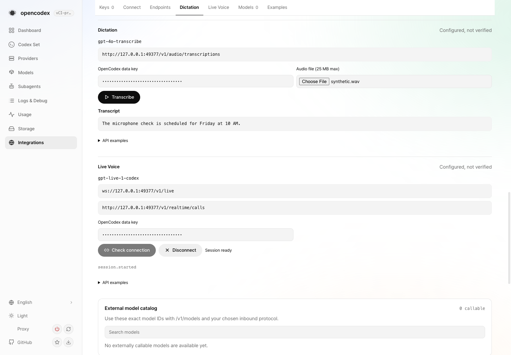
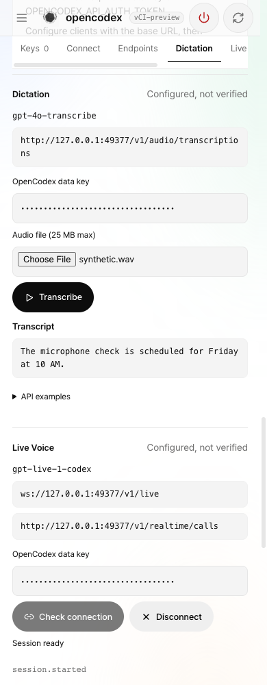
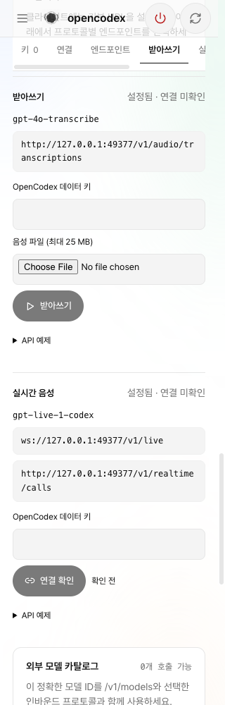

# Connections audio verification

## Delivered surface

Ordinary dependency chain remains open: [#4391](https://github.com/lidge-jun/opencodex/pull/4391)
-> [#4392](https://github.com/lidge-jun/opencodex/pull/4392)
-> [#4395](https://github.com/lidge-jun/opencodex/pull/4395).
No native stack registration, merge, release, deployment or live-service restart.

The top layer adds validated audio metadata, separate Dictation and Live Voice
blocks, temporary data-key input, cancelable upload/copy, connection-only native
session readiness, client examples and all nine dashboard locales. It does not
add audio models to text completion tests. Invalid/missing metadata leaves existing
key management usable. Configured availability is not account entitlement.

## Executable proof

Runtime/UI source head: `f5aefd88af3116bec4f2ddc72c0c6fa974f52a83`.
Remote [run 34690242138](https://github.com/lidge-jun/opencodex/actions/runs/34690242138),
gates job 103544165369: SUCCESS for lint, typecheck, dashboard tests, privacy,
generated skill surface, release syntax, dashboard build and CLI smoke.
Artifact 10296892796 is `dashboard-preview-bb0f30fbab4496b2b69bbc1e8148e59035ba3778`.
Its GUI tree `5ccecf06a8e144e5260f4991047db6fa36f464a1` exactly matches source.
The artifact names the tested PR merge, not a different runtime build.

Local product tests, typecheck, build, dependency installation and suites:
**NOT RUN**, per owner restriction. Every commit/push used `--no-verify`.
The only local execution was a static Node file server for the CI-built artifact
and browser QA through the already installed Playwright dependency. No proxy
runtime, provider audio request, personal recording or microphone was used.

## Browser matrix

Invocation: static artifact server, then `.tmp/audio-browser-run.mjs` driving
`/#integrations/keys` with intercepted synthetic management/audio routes.
Installed agbrowse lacked its documented script command, so the existing
agbrowse Playwright dependency drove a separate CDP browser on port 9231.
No new browser dependency was installed.

| Scenario | Observed result |
| --- | --- |
| Upload synthetic file | Expected transcript; typed data key only, no management/CSRF headers |
| Copy transcript | Actual browser clipboard contained the exact transcript |
| Live connect/disconnect | session.update, session.started with ID, session.close; no audio frames |
| HTTP 401 | Localized error, raw provider material absent |
| Cancel slow response | No late transcript published |
| Leave/re-enter API tab | Pending resources released, temporary key cleared |
| Storage inspection | No typed key in localStorage/sessionStorage |
| Keyboard | Key input -> file input follows Tab order |
| 1440/1024/768/390/320 | No audio-control overflow; settled screenshots read back |
| Korean 1440/390/320 | Labels fit; no new-section overlap or clipped Korean text |
| Runtime | No page JavaScript errors; no external network requests |

Initial captures exposed mobile top-bar overlap and a two-line tablet section
strip. Both were fixed; final screenshots below depict the corrected source.
Mobile scroll-spy uses the same 108px reading line as section positioning.

`screenshots/transcription-layer-baseline.png` separately renders the bottom PR's
own CI artifact (run 34687369123, merge d9771b3133863f5be1b89213029b0a8037dbcb89,
GUI tree 999781a53536c82ccfbfd376083e945bf388c55d). That layer changes GUI test
fixtures and asset provenance only; this capture does not claim the audio UI
exists in the bottom layer.

## Review and remaining limits

Inherited security review closed metadata projection and post-readiness failures.
Inherited component review closed endpoint styling, replacement-race and cache
observation coverage. Subsequent xai/grok-4.6 review closed idle status and mobile
scroll-spy alignment. Source verdicts: PASS. Rendered evidence is separate from
source review; neither establishes real provider availability.

Unrelated journal restore failures remain recorded in `021_streaming_checks.md`.
Old/superseded or cancelled whole runs are not passing final-head evidence. No
whole-suite-green or merge-readiness claim is made. PRs remain open for review.
