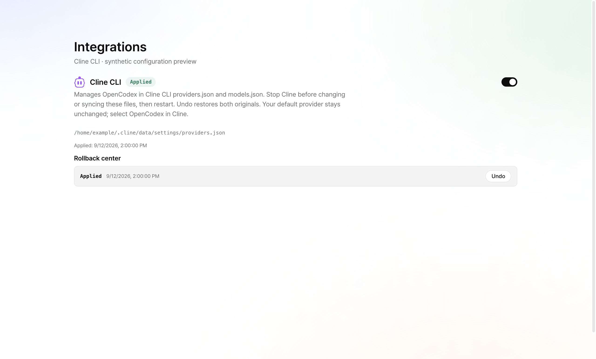
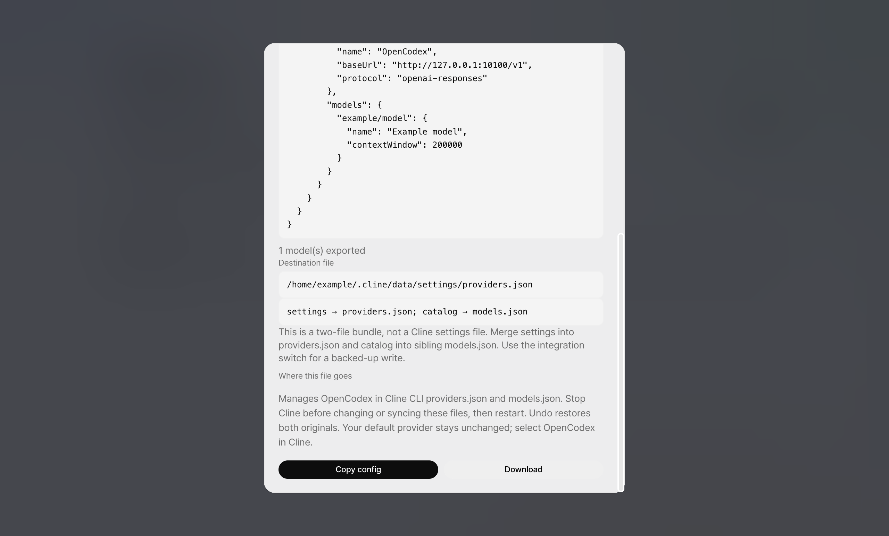

# Cline component render evidence

Source commit: 75a8ec8f78718f25343344506e8a5536ca0245a4. GUI tree: bd02a7729603ac669acf47988b065bd8d04dd617.

The actual FileIntegrationPage and ClientConfigDialog components were rendered in Chrome at
1280 × 773 CSS pixels, DPR 2, with the repository stylesheet, LanguageProvider and committed
Cline mark. The surrounding header labels the view synthetic. Fetch was replaced with fixed
fictional status/history; no real Cline configuration or running OpenCodex API was accessed.

The source-only preview entry was bundled with Bun in 20 ms using existing React 19.2.8,
without install, typecheck or product build scripts. This is manual component render evidence,
not a test-suite pass, live client canary, or full dashboard build. Local suites remain NOT RUN.

Observed: Cline label/mark, applied status, localized two-file stop/restart explanation, primary
path and Undo history rendered without clipping. Export dialog shows the settings/catalog bundle.

The export dialog was scrolled to its instructions. Observed both destination file names, the
journaled integration recommendation and stop/restart explanation; the single-file merge hint
and missing-admission-key hint are absent for Cline.

Export capture refreshed after removing the irrelevant Set-the-key heading. GUI tree: a070b75cabe1974e59d407c595709d1ffb3c4a58. Same synthetic harness; entry bundling took 19 ms. No local test execution.
