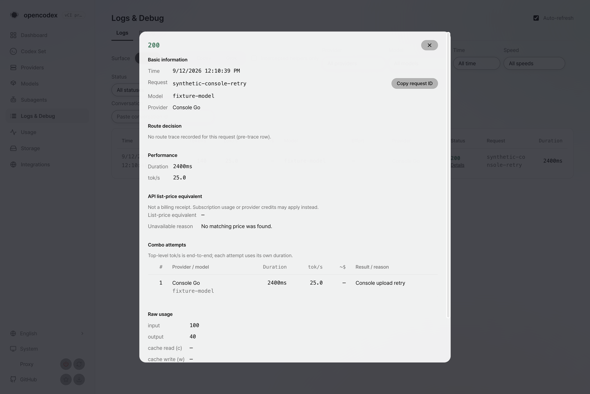

# Stream delivery verification update

Five source fixes were delivered as independent dev-based PRs. PR4341 (terminal integrity) is merged; PR4354 (Console), PR4356 (search), PR4363 (Cursor) and PR4367 (live sideband) remain open at the 2026-09-12 verification update. This task does not merge integration branches. Runtime verification remains incomplete; shared Cline, history and Windows failures are not treated as passing baseline evidence.

## Console label capture

The capture uses the dashboard-preview artifact from GitHub Actions run34675214816, artifact10294058486, recorded build commit f9dcd6449298821e6ba02d026037a677effe6aaa and GUI tree e0d22385336080717ad29a14d65a270a207a41e7. The artifact was built in hosted CI. No local product build, install, typecheck or test suite ran.

The artifact GUI differs from Console source head2c63a5d4283936aa9d0525e39090afb5e492c0ec only in Combo workspace files and associated tests; Logs.tsx, its locale strings and styles are unchanged. The Logs page was served locally from the existing bundle with a synthetic API fixture. The screenshot shows the actual Console upload retry label in the request detail dialog. Values, request ID and model are synthetic, not live request or billing evidence. This is rendered label evidence, not a backend retry test.

## Remaining acceptance

- #3389 remains HOLD: zero observed bytes cannot establish upstream nonexecution.
- #4191 retains its native failing-stage evidence requirement; existing diagnostics are not a reproduced fix.
- #4312 has its open-tool status sub-defect addressed; the actual client nonretryable refusal contract remains unresolved.
- #3506 requires a redacted translation-fidelity exchange. No semantic-progress cutoff is added.

Fresh source/security reviews and exact CI heads/runs are retained in the task-local handoff. Skipped, cancelled, failed and superseded runs do not certify completion. Local suites/build/typecheck/install: NOT RUN.
