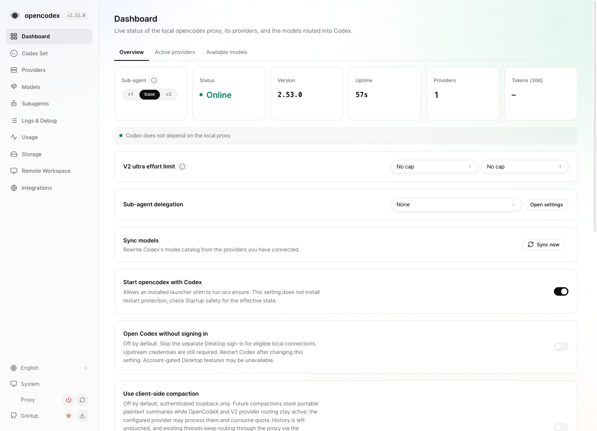
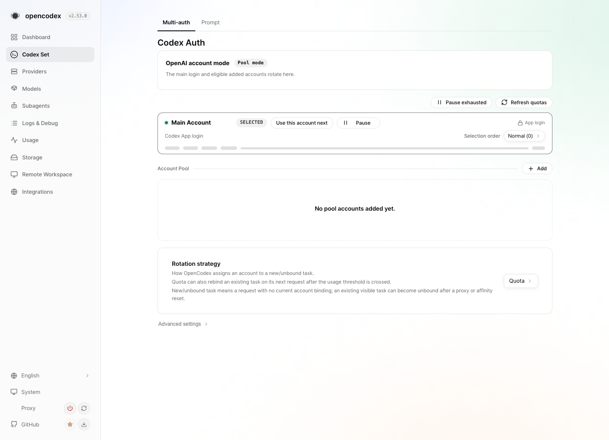
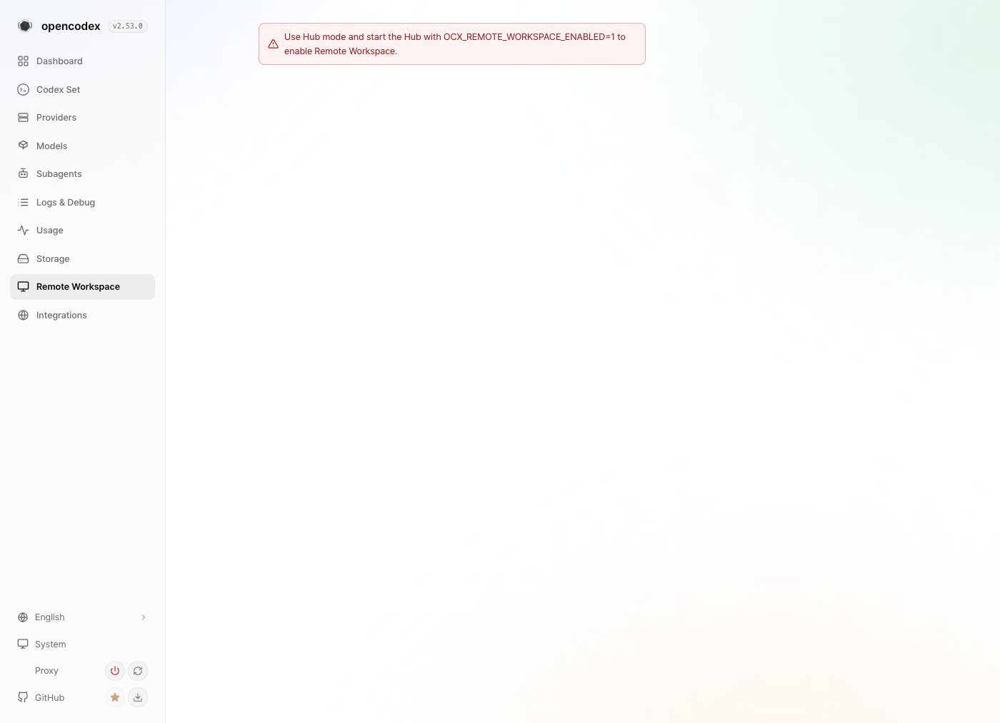
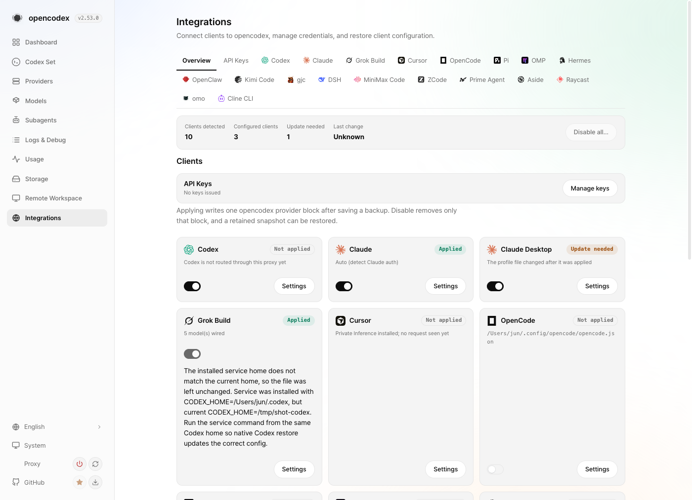

# Outcome and regression audit

All 36 pull requests in this batch are merged into `dev`. This document is the
closing record: what landed, what proved it, and what the mechanism cost.

## What landed

| Lane | Pull requests | How it landed |
| --- | --- | --- |
| audio | #4391, #4392, #4395 | squash cascade, then the `dev`-based root |
| responses | #4346, #4354, #4345, #4355, #4359, #4351 | one merge commit on the tip |
| singles | #4356, #4363, #4367, #4366, #4378, #4402, #4414, #4353, #4364 | one merge commit on the tip |
| providers | #4374, #4376, #4358, #4370 | one merge commit on the tip |
| accounts + trio-remote | #4375, #4404, #4408, #4361, #4369, #4401, #4357, #4427, #4433, #4441, #4362, #4372 | #4373 collapsed into the accounts tip, then one merge commit landed both lanes |
| Spark retirement | #4334 | merged last, alone, against fully landed `dev` |

Six merge operations landed 36 pull requests. Every one reports `MERGED` with
its own merge commit rather than being closed by hand.

## Regression evidence

`dev` run 34736799436 concluded `success` on `dc33113a9`, a commit that already
contained the first 35 landings. `dev` run 34738735639 concluded `success` on
`cff737ce4`, a descendant of the #4334 merge `72601a173`, so the batch is green
including the Spark retirement.

Two `dev` runs on the batch's own merge commits ended `cancelled`
(34736508080 and 34737770670). Both were superseded by a newer push inside the
same concurrency group, which is the workflow behaving as configured, not a
failure. The completed runs above are the evidence that matters, because they
ran on commits that contain everything those cancelled runs would have covered.

## What the CI economy actually saved

Only the lane tips ran the full matrix. A serial per-pull-request gate would
have needed 36 runs at roughly 10 to 15 minutes each. The batch used six tip
runs plus re-runs after fixes.

The mechanism worked exactly as designed and was verified live rather than
assumed: #4391 and #4392 carried only `enforce-target`, `hygiene`, `label` and
`resolve-pr`, while tip #4395 ran the full matrix.

## What the tips caught

Tip-only CI is only defensible if the tip run actually finds things, and it did.

The singles tip failed on five real lane-caused defects: an untranslated
`connection.pairing.hub` key shipped as English in the French catalog, a
`sidecar?.vision.enabled` read that threw when `sidecar` was absent and timed
out two pairing tests, and two `opencode-management-transport` cases that
assumed Bun's global `fetch` honours `HTTP_PROXY`.

The accounts tip failed on a deterministic budget violation:
`structure/gui-and-management-api.md` had grown to 605 lines against a 600-line
limit. It was cut to 599 rather than added to `grace.oversizeDocs`, because a
waiver without a split plan is not a fix.

Neither class of defect would have been visible before merge under a
naive interpretation of "skip CI on the links".

## Honest limits of this proof

Non-tip pull requests merged without their own `ci` check. MAINTAINERS.md
requires a successful required check before merge, and the
maintainer-integration clause waives the second maintainer's approval, not CI.
This batch is therefore a recorded owner-authorized deviation, stated in every
merge comment rather than left implicit.

What makes it defensible in substance is that each lane is cumulative: the
content of every link is a strict subset of what its tip's green run executed.
The evidence exists; it is attached to the tip rather than to each link.

Two lanes merged a head that differed from the CI-verified head by one
mechanical `origin/dev` re-merge — #4392 and #4370. Both resolutions were
verified before merge, and the second was re-checked with
`bun run structure:check`, `bun run typecheck` and `bun run privacy:scan`.

No local full test suite was run at any point in this batch. Every suite claim
traces to a hosted run id.

## Issue closure

Eleven issues were closed against landed `dev`: #2495, #3898, #4079, #4205,
#4206, #4208, #4211, #4236, #4308, #4314, #4315. Three of them GitHub had
already closed; the remaining eight were closed here with a comment naming the
landing pull request and the code that proves the behavior exists.

Each candidate was re-verified against `origin/dev` at `72601a173` rather than
trusted from the research pass, because that pass ran while the merges were
still in flight. The distinction that mattered repeatedly was `Refs #N` versus
`Closes #N`: several of the closures rest on a pull request that only
referenced the issue but did in fact implement the requested behavior, and at
least one issue is still claimed by an open contributor pull request (#4080
claims #4079) that the landed carry superseded.

## Screenshot gate

`enforce-target` fails with `missing UI screenshot` on any pull request that
mentions gui, which every cumulative tip carrying GUI work did. By owner
decision this was not treated as a merge blocker during the batch, and the
screenshots are collected here instead of being demanded from each lane tip in
flight.

They were captured from a Vite build of the landed `dev` tree, served by a
throwaway proxy instance on an unused port with isolated `OPENCODEX_HOME` and
`CODEX_HOME` directories, then torn down. That instance briefly rewrote the
host's Grok integration block to its own port; it was restored to the real
proxy afterwards and verified, which is worth recording because starting a
second instance is not as side-effect-free as it looks.

