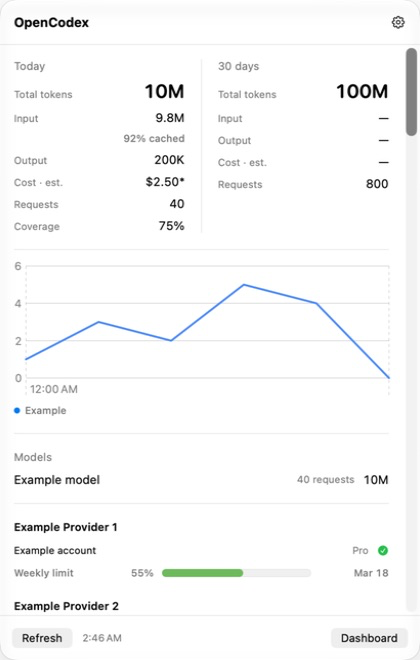
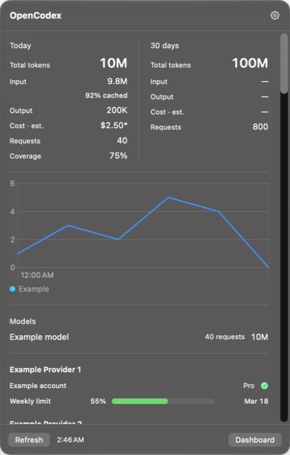
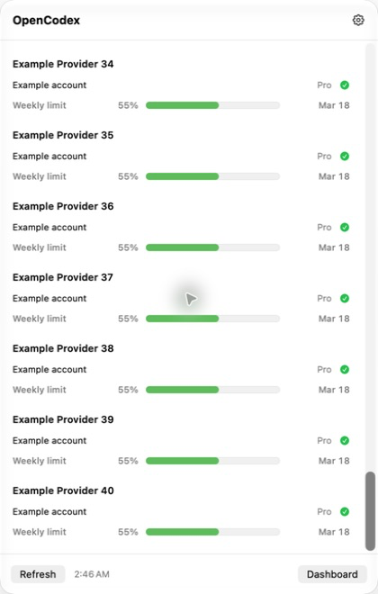

# Native tray integration verification

The macOS tray now opens an AppKit panel containing SwiftUI. The existing Tauri process owns the status item and runtime attachment. One native Liquid Glass surface owns the outline on supported systems; older systems use native popover material. Windows/Linux retain their web popup.

## Observed evidence

- The user confirmed the installed app works on the actual display on 2026-09-22. This is human acceptance of the reported interaction/appearance issue, not an automated compositor measurement.
- The installed app loaded real usage/accounts, scrolled to the bottom (AX scroll value 1), dismissed with Escape and reopened. Private account captures remain ignored scratch, not public evidence.
- The production panel classes rendered the synthetic fixture in light/dark mode; screenshots below contain no real account data. The latest light image includes the final chart legend. Native chart and legend remain readable above a bounded scroll region with fixed header/footer.
- Native fixture exercised toggle-close, toggle-reopen and dismissal on key loss. Runtime material was NSGlassEffectView. The original probe measured external focus preservation before its own activation and key-window state afterwards, so that log does not prove both simultaneously on first opening.
- Xcode 27 built the NativeTray scheme and WidgetKit extension. Widget history retained @main, _NSExtensionMain and application-extension compilation together. The existing widget is independently packaged.
- Rust release tests: 95 passed, including a real HTTP stalled-quota/available-usage case, deadline retention, missing-vs-zero projection and same-model/different-provider series. Swift native model assertions: 26 passed; MenuBarCore: 118 passed. Focused desktop release/widget/CLI contracts: 40 passed.
- Cargo clippy with warnings denied passed before the final chart-only projection change. Docs site built 497 pages; privacy and structure checks passed.
- Signed bundle verification checks hardened runtime and exact JIT-only host/CLI entitlements, sandbox-only widget entitlement, deep signature, final dyld NSGlassEffectView binding and isolated-home bundled CLI resolve. No runtime service takeover is needed to open the tray.

The dark and bottom images precede the final chart-only legend adjustment; panel geometry, material and scroll implementation are identical. All images show the native window capture, not a full-screen composite. Xcode 27 logs a nonfatal Swift Charts custom-UnitPoint warning even with standard axis anchors; inspected labels are aligned, and this record does not claim the warning was fixed.

## Independent review and limits

Sol identified loss of partial results under an overall timeout, forced foreground activation, and the scope of the JIT entitlement. Main implemented independent bounded section collection, removed forced activation and added final-artifact entitlement assertions. The host and bundled CLI deliberately share Tauri's minimal JIT entitlement; the widget remains sandbox-only. Detailed pre-publication security review stays in ignored scratch.

The native integration does not certify release readiness. Full prepush reached 28,463 passes, 36 skips and 21 failures. A source-identical baseline reproduced the release fixture failure and six other named failures, then exceeded the suite's 900-second limit with remote-workspace/account-pool tests still running. No failed, timed-out or absent gate is counted as green. The next PABCD cycle owns the full v2.59.0-to-candidate review, those failures and release gates.

The failed NSPopover direction was replaced with the key-capable NSPanel mechanism from 38a5ab9fc4; the old companion process was not restored. Evidence contradicting the current approach would be a reproducible focus, scrolling, rounded-outline or partial-result failure in the installed native panel. User acceptance and targeted checks support this integration; full-suite and cross-platform release proof remain outstanding.

## Final wp2 check

Final C receipt executed Rust95, cargo fmt/clippy with warnings denied, the signed-bundle verifier, structure check and diff whitespace checks: exit 0. Sol's final staged-delta review reported no remaining native code findings, blocking_issues=0, VERDICT: PASS. The chart-final app was installed with a preserved previous-app backup; its native Show Usage menu loaded real data and ten chart series. The running proxy was not replaced or restarted. This closes wp2 only; wp3 and both releases remain open.
