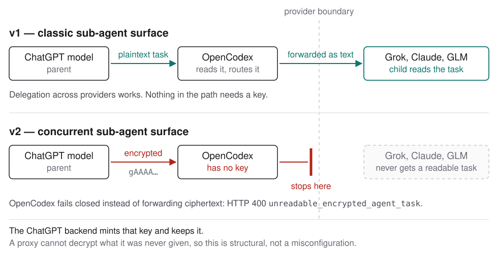

opencodex를 설치하면 서브에이전트 서피스가 **v1**로 설정됩니다. Dashboard, Models, Subagents 페이지에서 **base**나 **v2**로 바꾸려면 확인을 요청하며, 그 확인 창에서 이 문서로 연결됩니다. CLI에서는 확인 메시지가 나오지 않습니다.

이유는 분명합니다. v2에서 ChatGPT 네이티브 모델이 라우팅된 모델에 맡긴 작업은 라우팅된 모델이 읽을 수 없습니다. GPT 부모가 Grok, Claude, GLM 자식을 만드는 것은 가장 흔한 위임 방식인데, v2에서는 매번 실패합니다.

## 문제가 생기면 보이는 것

자식에게 빈 작업이 조용히 전달되는 대신 스폰 요청이 거부됩니다.

```json
{
  "error": {
    "code": "unreadable_encrypted_agent_task",
    "message": "Routed V2 worker task is encrypted for the native ChatGPT backend and cannot be read by the selected provider. Use plaintext V2 agent-message delivery or select a native ChatGPT model."
  }
}
```

HTTP 400을 반환하며 암호문은 응답에 포함하지 않습니다. 읽을 수 없는 페이로드를 전달하면 자식은 빈 지시를 받고 틀린 답을 확신 있게 내놓을 수 있어 의도적으로 안전하게 실패합니다.

## 발생 원인



v1에서는 부모가 자식 작업을 평문으로 내보냅니다. opencodex가 이를 읽고 라우팅하므로 자식이 실행할 수 있는 작업을 받습니다.

v2에서는 부모가 ChatGPT 백엔드에서 만든 `encrypted_content`로 작업을 내보냅니다. 키는 그 백엔드에만 있습니다. opencodex에는 키가 없으므로 프록시가 복호화하거나 다시 쓸 수 없습니다. 플래그 뒤에 숨은 평문이 아니라 실제 암호문입니다. 따라서 설정 오류가 아니라 구조적인 문제이며 프록시 설정으로 해결할 수 없습니다.

영향받지 않는 연결 방식은 세 가지입니다. 어떤 경계에서 실패하는지 보면 이유가 드러납니다.

| 연결 방식 | v1 | v2 |
| --- | --- | --- |
| ChatGPT 부모 → 라우팅된 자식 | 작동 | **실패** |
| 라우팅된 부모 → 라우팅된 자식 | 작동 | 작동 |
| ChatGPT 부모 → ChatGPT 자식 | 작동 | 작동 — 백엔드가 자신이 만든 암호문을 복호화할 수 있음 |

백엔드는 자신이 만든 암호문을 언제나 읽을 수 있습니다. 경계를 넘을 때만 문제가 생깁니다.

## 업스트림에서 해결됐나요?

아직 아닙니다. 중요한 절반은 남아 있습니다. 업스트림은 평문 협업 메시지 지원을 추가한 [openai/codex#35845](https://github.com/openai/codex/pull/35845)를 병합했습니다. 하지만 이는 이미 생성된 평문을 처리하는 *수신* 측 변경입니다. OpenAI 부모가 평문을 생성하게 만들지는 않습니다.

송신 측 문제는 아직 열려 있습니다. Windows, macOS, Linux의 CLI 0.146~0.151에서 재현된 [#36376](https://github.com/openai/codex/issues/36376)과 송신 측 전달 정책의 부재를 직접 지적한 [#37197](https://github.com/openai/codex/issues/37197)입니다. 어느 쪽에도 유지관리자의 해결 약속이나 예정 시점이 없습니다.

opencodex는 결과를 [#92](https://github.com/lidge-jun/opencodex/issues/92)에 기록하고 계획 없음으로 닫았습니다. 이 저장소에서 해결할 수 없으므로 이슈는 여기 유지관리자를 기다리는 작업이 아니라 업스트림 작업을 가리킵니다.

## 현재 세 모드의 동작

| 모드 | 서피스 | 선택할 때 |
| --- | --- | --- |
| **v1** (기본값) | 모든 모델이 기존 네임스페이스 방식 스폰 도구를 표시합니다. 스폰 시 다른 모델을 직접 지정할 수 있습니다. | 프로바이더 간 위임을 사용하는 경우. 설치 시 기본값입니다. |
| **base** | 업스트림 모델 핀을 따릅니다. Sol과 Terra는 v2, Luna는 v1을 사용하며, 핀이 없는 모델은 Codex 자체 플래그를 따릅니다. | Codex가 모델별로 의도한 서피스를 원하고 한 프로바이더 안에서만 위임하는 경우. |
| **v2** | 모든 모델이 새로운 플랫 동시 실행 도구를 표시합니다. | 새로운 동시 세션 모델을 원하고 부모와 자식이 같은 경계 쪽에 있는 경우. |

base가 첫 번째가 아니라 두 번째인 이유는 대부분의 위임 출발점인 Sol과 Terra가 핀에 따라 v2를 사용하기 때문입니다. 이 문제에서 base는 절충 설정이 아닙니다. ChatGPT에서 라우팅된 모델로 스폰할 때는 v2처럼 동작합니다.

## 이미 base나 v2를 선택했다면

기존 설정은 바뀌지 않습니다. 이 기본값이 포함된 버전으로 업그레이드해도 기존 설정을 다시 쓰지 않으며, 대시보드가 알림을 한 번 보여주고 선택을 기다립니다.

- **Continue**는 현재 모드를 유지하고 다시 묻지 않습니다.
- **Switch to v1**은 v1을 적용하고 다시 묻지 않습니다.

어느 쪽이든 응답이 기록되어 알림이 다시 나타나지 않습니다. 응답하지 않고 닫으면 다음 대시보드 방문 때 다시 보입니다.

모드 변경은 **새** Codex 세션에 적용됩니다. 선택한 뒤 새 세션을 시작하세요. 오래 실행된 App 호스트에 예전 서피스가 남아 있으면 `ocx sync`를 실행하고 해당 서피스를 다시 시작하세요.

## 그래도 v2를 원한다면

대부분의 사용자에게 권장하는 순서로 네 가지 방법이 있습니다.

1. **ChatGPT를 v1로 유지합니다.** v2에서 `keepNativeChatGptOnV1` 스위치를 켜면 Sol과 Terra는 v1에 남아 Grok이나 Claude를 스폰할 수 있고, 라우팅된 부모는 v2를 사용합니다. 두 서피스를 함께 쓰는 데 가장 가깝습니다.
2. **한 프로바이더 안에서 위임합니다.** 라우팅된 부모가 라우팅된 자식을 스폰하면 v2에서도 평문이므로 정상 작동합니다.
3. **직접 키 인증 Responses 릴레이를 신뢰합니다.** `allowEncryptedV2AgentTasks: true`로 명시한 프로바이더는 400 대신 불투명한 페이로드를 받습니다. 이를 처리할 수 있다고 확실히 아는 목적지에만 사용하세요.
4. **`agentTaskRecovery`를 켭니다.** 실험적 기능으로 기본값은 꺼져 있습니다. ChatGPT 백엔드를 거쳐 읽을 수 없는 암호화된 `NEW_TASK`, `MESSAGE`, `FOLLOWUP_TASK`, `FINAL_ANSWER` 항목을 복구하지만, 할당량과 지연 시간, 문서화되지 않은 동작에 대한 의존이라는 비용을 치릅니다. 콤보 복구는 스폰된 자식 턴으로 제한되며, 분할된 토큰 조각은 여전히 지원되지 않습니다.

각 방식의 전체 동작은 [서브에이전트 서피스](/ko/guides/sub-agent-surface/), 설정 자체는 [에이전트 설정](/ko/reference/configuration/agents/)을 참고하세요.

## 이 문서가 필요 없어지는 때

업스트림 릴리스에서 ChatGPT 네이티브 부모가 라우팅된 자식의 작업을 평문으로 내보내게 되면 이 기본값의 이유도 사라집니다. 그때 기본값은 base로 돌아가고 확인 창은 더 이상 나오지 않으며, 이 문서는 사용 안내가 아니라 지난 기록이 됩니다.

## 모드 변경

Dashboard, Models, Subagents 모두 같은 v1/base/v2 스위치를 제공하며 base나 v2를 선택하면 확인을 요청합니다. CLI에서는 다음을 실행하세요.

```bash
ocx v2 status
ocx v2 mode v1
```

CLI는 확인 메시지를 띄우지 않습니다. 같은 설정이므로 이 문서의 동작을 이해한 뒤 선택하세요.
